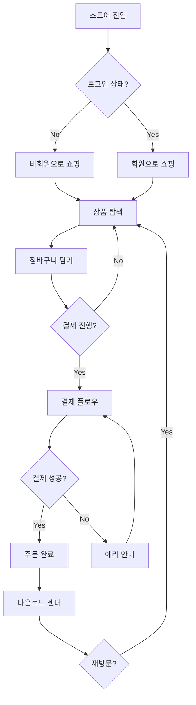
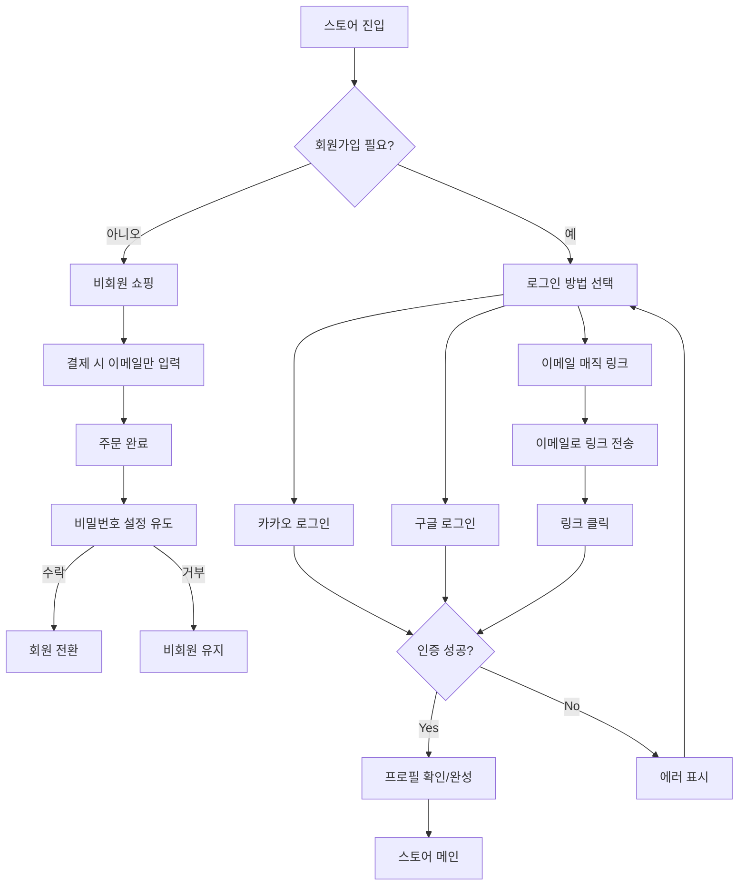
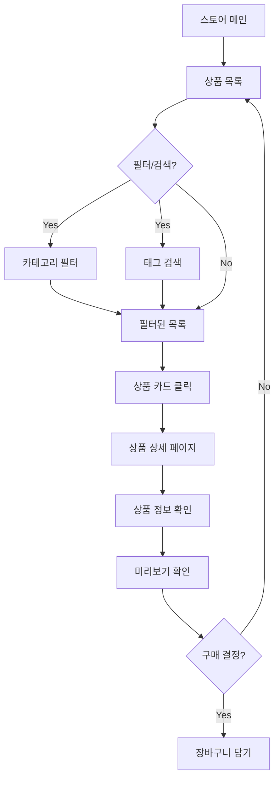
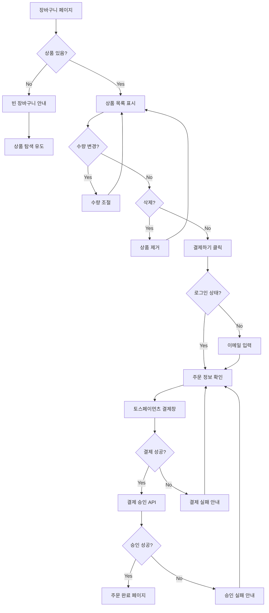
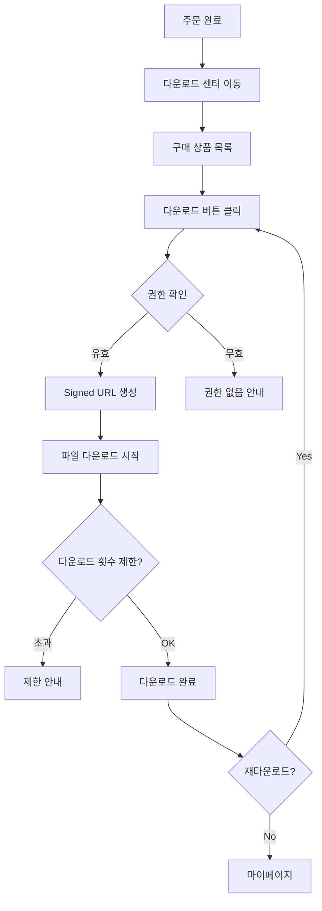
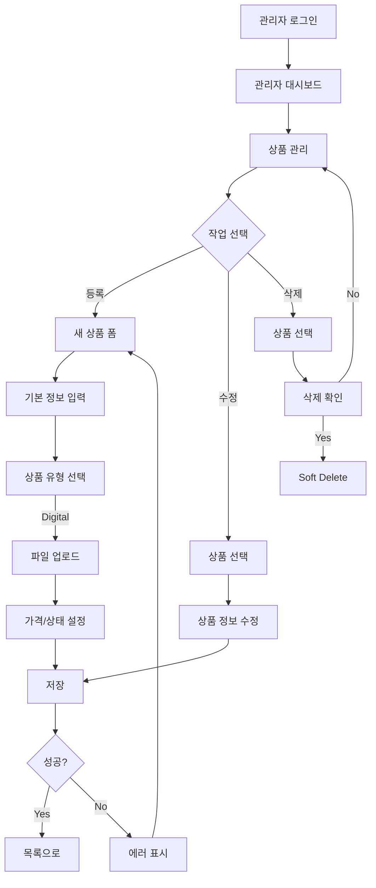
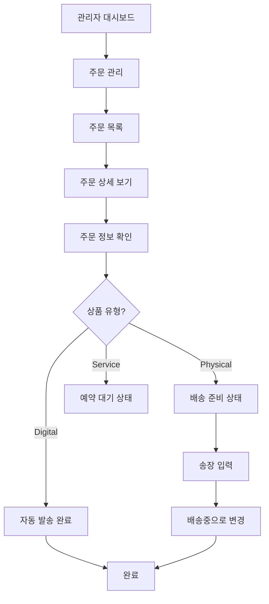
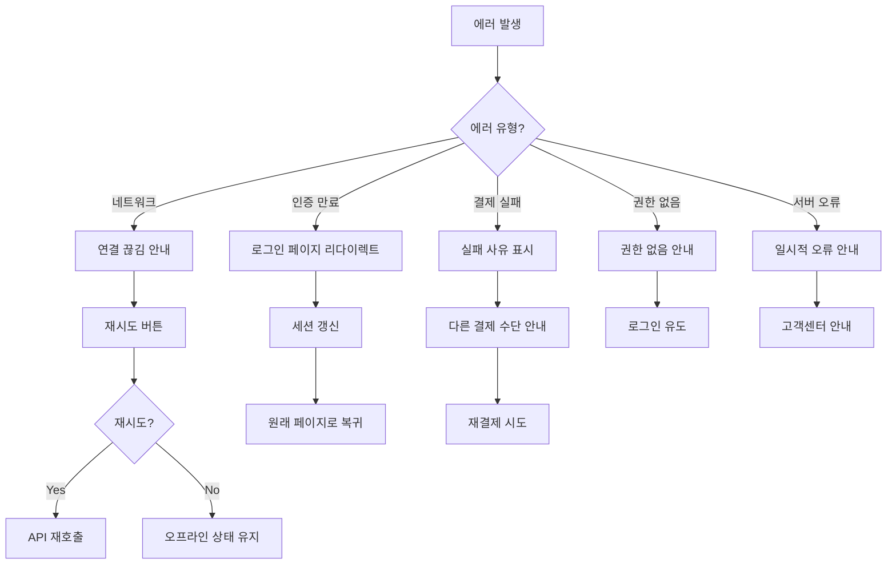

# User Flow (사용자 흐름도)

> Vibe Store의 핵심 사용자 여정

---

## MVP 캡슐

| # | 항목 | 내용 |
|---|------|------|
| 1 | 목표 | 라이브 코딩 콘텐츠용 쇼핑몰 스캘레톤 완성 |
| 2 | 페르소나 | 실력이 부족하지만 AI로 커스터마이징 가능한 비개발자 |
| 3 | 핵심 기능 | FEAT-1: 디지털 상품 판매 (리스트/상세/결제/다운로드) |
| 4 | 성공 지표 (노스스타) | 유튜브 구독자 수 (5천 → 1만, 3개월) |
| 5 | 입력 지표 | 라이브 시청자 수, 스캘레톤 다운로드 수 |
| 6 | Out-of-scope | 실물 배송, 코칭 예약 (Phase 2) |
| 8 | Top 리스크 | Supabase RLS 보안 정책 설정 복잡도 |
| 10 | 다음 단계 | 프로젝트 초기 세팅 (Next.js + Supabase) |

---

## 1. 전체 사용자 여정 (Overview)



---

## 2. FEAT-0: 온보딩/로그인 플로우



---

## 3. FEAT-1: 디지털 상품 구매 플로우

### 3.1 상품 탐색



### 3.2 장바구니 & 결제



### 3.3 다운로드 센터



---

## 4. FEAT-2: 관리자 플로우

### 4.1 상품 관리



### 4.2 주문 관리



---

## 5. 에러 처리 플로우



---

## 6. 화면 목록 (Screen Inventory)

### 6.1 고객 화면 (Shop)

| 화면 ID | 화면명 | FEAT | 경로 | 주요 액션 |
|---------|--------|------|------|----------|
| S-01 | 홈 | - | / | 메인 진입 |
| S-02 | 상품 목록 | FEAT-1 | /products | 상품 탐색 |
| S-03 | 상품 상세 | FEAT-1 | /products/[id] | 상품 정보, 장바구니 담기 |
| S-04 | 장바구니 | FEAT-1 | /cart | 장바구니 관리 |
| S-05 | 결제 | FEAT-1 | /checkout | 주문 정보, 결제 |
| S-06 | 결제 완료 | FEAT-1 | /checkout/success | 주문 확인, 다운로드 안내 |
| S-07 | 마이페이지 | FEAT-1 | /my | 계정 정보 |
| S-08 | 주문 내역 | FEAT-1 | /my/orders | 주문 목록 |
| S-09 | 다운로드 센터 | FEAT-1 | /my/downloads | 구매 상품 다운로드 |
| S-10 | 로그인 | FEAT-0 | /login | 소셜/이메일 로그인 |

### 6.2 관리자 화면 (Admin)

| 화면 ID | 화면명 | FEAT | 경로 | 주요 액션 |
|---------|--------|------|------|----------|
| A-01 | 대시보드 | FEAT-2 | /admin | 현황 요약 |
| A-02 | 상품 목록 | FEAT-2 | /admin/products | 상품 관리 |
| A-03 | 상품 등록/수정 | FEAT-2 | /admin/products/[id] | 상품 CRUD |
| A-04 | 주문 목록 | FEAT-2 | /admin/orders | 주문 관리 |
| A-05 | 주문 상세 | FEAT-2 | /admin/orders/[id] | 주문 처리 |

---

## 7. 감정 여정 (Emotional Journey)

```
진입 → 탐색 → 발견 → 결정 → 결제 → 완료 → 사용

😐    😊    🤩    🤔    😰    🎉    😍
호기심  흥미   "이거다!" 고민   긴장   성취   만족

디자인 포인트:
- 탐색: 시각적으로 매력적인 상품 카드
- 발견: 미리보기로 가치 확인
- 결정: 명확한 가격, 포함 내용 표시
- 결제: 빠르고 간편한 토스페이먼츠
- 완료: 즉시 다운로드 가능 안내
- 사용: 깔끔한 다운로드 센터
```

---

## Decision Log

- 비회원 주문 지원: 가입 장벽 최소화, 주문 후 회원 전환 유도
- Fast Track 결제: 디지털 상품은 장바구니 건너뛰기 옵션 제공
- 다운로드 제한: 무제한 대신 횟수/기간 제한으로 남용 방지
