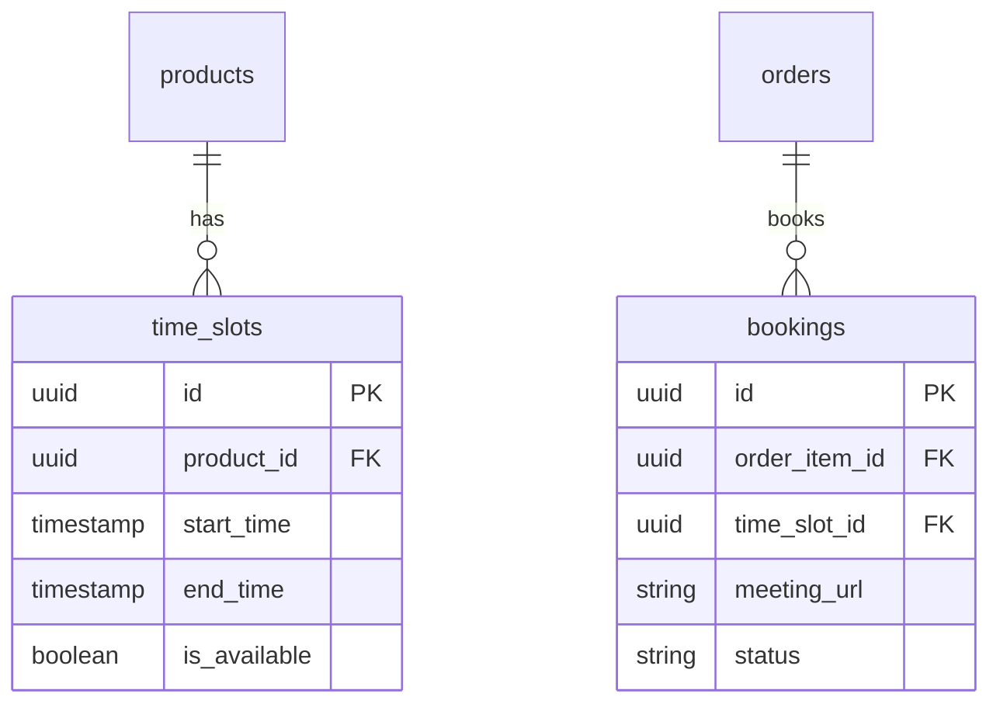

# Database Design (데이터베이스 설계)

> Vibe Store의 Supabase PostgreSQL 스키마

---

## MVP 캡슐

| # | 항목 | 내용 |
|---|------|------|
| 1 | 목표 | 라이브 코딩 콘텐츠용 쇼핑몰 스캘레톤 완성 |
| 2 | 페르소나 | 실력이 부족하지만 AI로 커스터마이징 가능한 비개발자 |
| 3 | 핵심 기능 | FEAT-1: 디지털 상품 판매 (리스트/상세/결제/다운로드) |
| 4 | 성공 지표 (노스스타) | 유튜브 구독자 수 (5천 → 1만, 3개월) |
| 5 | 입력 지표 | 라이브 시청자 수, 스캘레톤 다운로드 수 |
| 6 | 비기능 요구 | Supabase RLS 기반 보안 |
| 7 | Out-of-scope | 실물 배송, 코칭 예약 (Phase 2) |
| 8 | Top 리스크 | Supabase RLS 보안 정책 설정 복잡도 |
| 9 | 완화/실험 | RLS 정책 템플릿화 + 라이브에서 단계별 설명 |
| 10 | 다음 단계 | 프로젝트 초기 세팅 (Next.js + Supabase) |

---

## 1. ERD (Entity Relationship Diagram)

```mermaid
erDiagram
    %% FEAT-0: 사용자 관리
    profiles {
        uuid id PK "auth.users.id와 연결"
        string email UK "이메일"
        string nickname "표시 이름"
        string avatar_url "프로필 이미지"
        string role "user | admin"
        timestamp created_at
        timestamp updated_at
    }

    %% FEAT-1: 카테고리 (계층형)
    categories {
        uuid id PK
        uuid parent_id FK "상위 카테고리 (nullable)"
        string name "카테고리명"
        string slug UK "URL용 슬러그"
        string description "설명"
        string image_url "카테고리 이미지"
        int sort_order "정렬 순서"
        boolean is_active "활성화 여부"
        timestamp created_at
        timestamp updated_at
    }

    %% FEAT-1: 상품
    products {
        uuid id PK
        uuid category_id FK "카테고리"
        string name "상품명"
        string slug UK "URL용 슬러그"
        text description "상세 설명 (Markdown)"
        text short_description "짧은 설명"
        int price "가격 (원)"
        int discount_price "할인가 (nullable)"
        string type "digital | physical | service"
        jsonb metadata "유형별 추가 정보"
        string status "draft | active | archived | hidden"
        boolean is_featured "추천 상품"
        int view_count "조회수"
        int sales_count "판매수"
        timestamp created_at
        timestamp updated_at
    }

    %% FEAT-1: 상품 이미지 (다중)
    product_images {
        uuid id PK
        uuid product_id FK
        string url "이미지 URL"
        string alt_text "대체 텍스트"
        int sort_order "정렬 순서"
        boolean is_primary "대표 이미지"
        timestamp created_at
    }

    %% FEAT-1: 상품 파일 (디지털 상품용)
    product_files {
        uuid id PK
        uuid product_id FK
        string name "파일명"
        string storage_path "Storage 경로"
        bigint size "파일 크기 (bytes)"
        string mime_type "파일 타입"
        int download_limit "다운로드 제한 횟수"
        int download_days "다운로드 유효 기간 (일)"
        timestamp created_at
    }

    %% FEAT-1: 상품 태그
    tags {
        uuid id PK
        string name UK "태그명"
        string slug UK "URL용 슬러그"
    }

    product_tags {
        uuid product_id FK
        uuid tag_id FK
    }

    %% FEAT-1: 장바구니
    cart_items {
        uuid id PK
        uuid user_id FK "nullable - 비회원은 세션 기반"
        string session_id "비회원 세션 ID"
        uuid product_id FK
        int quantity "수량"
        timestamp created_at
        timestamp updated_at
    }

    %% FEAT-1: 주문
    orders {
        uuid id PK
        uuid user_id FK "nullable - 비회원 주문"
        string order_number UK "주문번호 (ORD-YYYYMMDD-XXXX)"
        string guest_email "비회원 이메일"
        string status "pending | paid | completed | cancelled | refunded"
        int total_amount "총 결제금액"
        jsonb payment_info "결제 정보 (토스)"
        timestamp paid_at "결제 완료 시간"
        timestamp created_at
        timestamp updated_at
    }

    %% FEAT-1: 주문 상품
    order_items {
        uuid id PK
        uuid order_id FK
        uuid product_id FK
        string product_name "주문 시점 상품명"
        int price "주문 시점 가격"
        int quantity "수량"
        timestamp created_at
    }

    %% FEAT-1: 다운로드 기록
    downloads {
        uuid id PK
        uuid order_item_id FK
        uuid product_file_id FK
        uuid user_id FK "nullable"
        int download_count "현재 다운로드 횟수"
        timestamp expires_at "다운로드 만료일"
        timestamp last_downloaded_at
        timestamp created_at
    }

    %% FEAT-6: 상품 후기
    reviews {
        uuid id PK
        uuid product_id FK "상품"
        uuid user_id FK "작성자"
        uuid order_item_id FK "구매 검증용"
        int rating "평점 (1-5)"
        string title "후기 제목"
        text content "후기 내용"
        jsonb images "이미지 URL 배열"
        int like_count "좋아요 수"
        int view_count "조회수"
        boolean is_best "베스트 후기"
        timestamp created_at
        timestamp updated_at
    }

    %% FEAT-6: 상품 문의
    inquiries {
        uuid id PK
        uuid product_id FK "상품"
        uuid user_id FK "작성자"
        string category "문의 유형"
        string title "문의 제목"
        text content "문의 내용"
        boolean is_private "비밀글 여부"
        string status "상태 (pending/answered)"
        text answer "관리자 답변"
        uuid answered_by FK "답변자"
        timestamp answered_at "답변 시간"
        int view_count "조회수"
        timestamp created_at
        timestamp updated_at
    }

    %% FEAT-6: 댓글 (다형성)
    comments {
        uuid id PK
        string commentable_type "review | inquiry"
        uuid commentable_id "후기/문의 ID"
        uuid parent_id FK "대댓글용 (nullable)"
        uuid user_id FK "작성자"
        text content "댓글 내용"
        int like_count "좋아요 수"
        timestamp created_at
        timestamp updated_at
    }

    %% FEAT-6: 좋아요 (다형성)
    likes {
        uuid id PK
        string likeable_type "review | comment"
        uuid likeable_id "후기/댓글 ID"
        uuid user_id FK "사용자"
        timestamp created_at
    }

    %% FEAT-7: 사용자 등급
    user_grades {
        uuid id PK
        string code UK "bronze | silver | gold | vip"
        string name "등급명"
        int min_order_amount "승급 조건 (누적 주문금액)"
        int discount_rate "할인율 (%)"
        int point_rate "적립율 (%)"
        int sort_order "정렬 순서"
        timestamp created_at
    }

    %% FEAT-7: 쿠폰
    coupons {
        uuid id PK
        string code UK "쿠폰 코드"
        string name "쿠폰명"
        string type "percent | fixed | free_shipping"
        int value "할인값 (% 또는 원)"
        int min_order_amount "최소 주문금액"
        int max_discount "최대 할인금액"
        timestamp start_at "시작일"
        timestamp end_at "종료일"
        int usage_limit "총 사용 가능 횟수"
        int used_count "현재 사용 횟수"
        boolean is_active "활성화 여부"
        timestamp created_at
        timestamp updated_at
    }

    %% FEAT-7: 쿠폰 사용 이력
    coupon_usages {
        uuid id PK
        uuid coupon_id FK "쿠폰"
        uuid user_id FK "사용자"
        uuid order_id FK "주문"
        int discount_amount "할인 금액"
        timestamp used_at "사용일"
    }

    %% FEAT-7: 사용자 보유 쿠폰
    user_coupons {
        uuid id PK
        uuid user_id FK "사용자"
        uuid coupon_id FK "쿠폰"
        timestamp issued_at "발급일"
        timestamp expires_at "만료일"
        boolean is_used "사용 여부"
        timestamp used_at "사용일"
    }

    %% FEAT-7: 재고 입출고 이력
    inventory_logs {
        uuid id PK
        uuid product_id FK "상품"
        string type "in | out | adjust"
        int quantity "수량 (+/-)"
        string reason "사유"
        uuid reference_id "참조 ID (order_id 등)"
        uuid created_by FK "처리자"
        timestamp created_at
    }

    %% 관계 정의
    categories ||--o{ categories : "has_children"
    categories ||--o{ products : "contains"
    profiles ||--o{ orders : "places"
    profiles ||--o{ cart_items : "has"
    products ||--o{ product_images : "has"
    products ||--o{ product_files : "has"
    products ||--o{ order_items : "ordered_in"
    products ||--o{ cart_items : "in_cart"
    products }|--o{ product_tags : "tagged"
    tags }|--o{ product_tags : "tags"
    orders ||--o{ order_items : "contains"
    order_items ||--o{ downloads : "enables"
    product_files ||--o{ downloads : "downloaded"

    %% 커뮤니티 관계
    products ||--o{ reviews : "has_reviews"
    products ||--o{ inquiries : "has_inquiries"
    profiles ||--o{ reviews : "writes"
    profiles ||--o{ inquiries : "asks"
    profiles ||--o{ comments : "comments"
    profiles ||--o{ likes : "likes"
    order_items ||--o| reviews : "verifies"
    reviews ||--o{ comments : "has_comments"
    inquiries ||--o{ comments : "has_comments"
    comments ||--o{ comments : "has_replies"

    %% 관리자 확장 관계
    user_grades ||--o{ profiles : "has_members"
    profiles ||--o{ user_coupons : "holds"
    profiles ||--o{ coupon_usages : "uses"
    coupons ||--o{ user_coupons : "issued_to"
    coupons ||--o{ coupon_usages : "used_in"
    orders ||--o{ coupon_usages : "applied"
    products ||--o{ inventory_logs : "tracks"
    profiles ||--o{ inventory_logs : "manages"
```



---

## 2. 엔티티 상세 정의

### 2.1 profiles (사용자) - FEAT-0

| 컬럼 | 타입 | 제약조건 | 설명 |
|------|------|----------|------|
| id | UUID | PK, FK → auth.users.id | Supabase Auth 연동 |
| email | VARCHAR(255) | UNIQUE, NOT NULL | 이메일 |
| nickname | VARCHAR(50) | NULL | 표시 이름 (미설정 시 이메일 앞부분) |
| avatar_url | VARCHAR(500) | NULL | 프로필 이미지 URL |
| role | VARCHAR(20) | NOT NULL, DEFAULT 'user' | user / admin |
| created_at | TIMESTAMPTZ | NOT NULL, DEFAULT NOW() | 가입일 |
| updated_at | TIMESTAMPTZ | NOT NULL | 수정일 |

**인덱스:**
- `idx_profiles_email` ON email
- `idx_profiles_role` ON role

### 2.2 categories (카테고리) - FEAT-1

| 컬럼 | 타입 | 제약조건 | 설명 |
|------|------|----------|------|
| id | UUID | PK, DEFAULT gen_random_uuid() | 고유 식별자 |
| parent_id | UUID | FK → categories.id, NULL | 상위 카테고리 (NULL = 최상위) |
| name | VARCHAR(100) | NOT NULL | 카테고리명 |
| slug | VARCHAR(100) | UNIQUE, NOT NULL | URL용 슬러그 |
| description | TEXT | NULL | 설명 |
| image_url | VARCHAR(500) | NULL | 카테고리 이미지 |
| sort_order | INTEGER | DEFAULT 0 | 정렬 순서 |
| is_active | BOOLEAN | DEFAULT true | 활성화 여부 |
| created_at | TIMESTAMPTZ | NOT NULL, DEFAULT NOW() | 생성일 |
| updated_at | TIMESTAMPTZ | NOT NULL | 수정일 |

**인덱스:**
- `idx_categories_parent_id` ON parent_id
- `idx_categories_slug` ON slug
- `idx_categories_sort_order` ON sort_order

**예시 구조:**
```
📁 디지털 상품 (digital)
   ├── 템플릿 (templates)
   ├── 이북 (ebooks)
   └── 소스코드 (source-code)
📁 실물 상품 (physical) - Phase 2
   ├── 굿즈 (merchandise)
   └── 책 (books)
📁 서비스 (service) - Phase 2
   ├── 코칭 (coaching)
   └── 컨설팅 (consulting)
```

### 2.4 products (상품) - FEAT-1

| 컬럼 | 타입 | 제약조건 | 설명 |
|------|------|----------|------|
| id | UUID | PK, DEFAULT gen_random_uuid() | 고유 식별자 |
| category_id | UUID | FK → categories.id, NULL | 카테고리 |
| name | VARCHAR(200) | NOT NULL | 상품명 |
| slug | VARCHAR(200) | UNIQUE, NOT NULL | URL용 슬러그 |
| short_description | VARCHAR(300) | NULL | 짧은 설명 (목록용) |
| description | TEXT | NULL | Markdown 상세 설명 |
| price | INTEGER | NOT NULL | 가격 (원) |
| discount_price | INTEGER | NULL | 할인가 (NULL = 할인 없음) |
| type | VARCHAR(20) | NOT NULL | digital / physical / service |
| metadata | JSONB | DEFAULT '{}' | 유형별 추가 정보 |
| status | VARCHAR(20) | NOT NULL, DEFAULT 'draft' | draft / active / archived / hidden |
| is_featured | BOOLEAN | DEFAULT false | 추천 상품 여부 |
| view_count | INTEGER | DEFAULT 0 | 조회수 |
| sales_count | INTEGER | DEFAULT 0 | 판매수 |
| created_at | TIMESTAMPTZ | NOT NULL, DEFAULT NOW() | 생성일 |
| updated_at | TIMESTAMPTZ | NOT NULL | 수정일 |

**metadata 예시 (type별):**
```json
// digital
{
  "file_format": "PDF",
  "file_size": "15MB",
  "preview_url": "https://..."
}

// physical (Phase 2)
{
  "weight": 500,
  "stock": 100,
  "shipping_fee": 3000,
  "sku": "PROD-001"
}

// service (Phase 2)
{
  "duration": 60,
  "booking_url": "https://..."
}
```

**인덱스:**
- `idx_products_category_id` ON category_id
- `idx_products_slug` ON slug
- `idx_products_status` ON status
- `idx_products_type` ON type
- `idx_products_is_featured` ON is_featured WHERE is_featured = true
- `idx_products_sales_count` ON sales_count DESC (인기순 정렬)
- `idx_products_created_at` ON created_at DESC (최신순 정렬)

### 2.5 product_images (상품 이미지) - FEAT-1

| 컬럼 | 타입 | 제약조건 | 설명 |
|------|------|----------|------|
| id | UUID | PK, DEFAULT gen_random_uuid() | 고유 식별자 |
| product_id | UUID | FK → products.id, NOT NULL | 상품 |
| url | VARCHAR(500) | NOT NULL | 이미지 URL |
| alt_text | VARCHAR(200) | NULL | 대체 텍스트 (접근성) |
| sort_order | INTEGER | DEFAULT 0 | 정렬 순서 |
| is_primary | BOOLEAN | DEFAULT false | 대표 이미지 여부 |
| created_at | TIMESTAMPTZ | NOT NULL, DEFAULT NOW() | 생성일 |

**인덱스:**
- `idx_product_images_product_id` ON product_id
- `idx_product_images_is_primary` ON (product_id, is_primary) WHERE is_primary = true

### 2.6 product_files (상품 파일) - FEAT-1

| 컬럼 | 타입 | 제약조건 | 설명 |
|------|------|----------|------|
| id | UUID | PK | 고유 식별자 |
| product_id | UUID | FK → products.id, NOT NULL | 상품 |
| name | VARCHAR(255) | NOT NULL | 파일명 |
| storage_path | VARCHAR(500) | NOT NULL | Supabase Storage 경로 |
| size | BIGINT | NOT NULL | 파일 크기 (bytes) |
| mime_type | VARCHAR(100) | NOT NULL | MIME 타입 |
| download_limit | INTEGER | DEFAULT 5 | 다운로드 제한 횟수 |
| download_days | INTEGER | DEFAULT 30 | 다운로드 유효 기간 (일) |
| created_at | TIMESTAMPTZ | NOT NULL, DEFAULT NOW() | 생성일 |

**인덱스:**
- `idx_product_files_product_id` ON product_id

### 2.7 orders (주문) - FEAT-1

| 컬럼 | 타입 | 제약조건 | 설명 |
|------|------|----------|------|
| id | UUID | PK | 고유 식별자 |
| user_id | UUID | FK → profiles.id, NULL | 회원 (비회원은 NULL) |
| order_number | VARCHAR(20) | UNIQUE, NOT NULL | 주문번호 |
| guest_email | VARCHAR(255) | NULL | 비회원 이메일 |
| status | VARCHAR(20) | NOT NULL, DEFAULT 'pending' | 상태 |
| total_amount | INTEGER | NOT NULL | 총 결제금액 |
| payment_info | JSONB | DEFAULT '{}' | 토스 결제 정보 |
| paid_at | TIMESTAMPTZ | NULL | 결제 완료 시간 |
| created_at | TIMESTAMPTZ | NOT NULL, DEFAULT NOW() | 생성일 |
| updated_at | TIMESTAMPTZ | NOT NULL | 수정일 |

**status 값:**
- `pending`: 결제 대기
- `paid`: 결제 완료
- `completed`: 처리 완료 (디지털: 자동, 실물: 배송 완료)
- `cancelled`: 취소
- `refunded`: 환불

**payment_info 예시:**
```json
{
  "orderId": "ORD-20240125-XXXX",
  "paymentKey": "토스_결제키",
  "method": "카드",
  "approvedAt": "2024-01-25T10:00:00+09:00"
}
```

**인덱스:**
- `idx_orders_user_id` ON user_id
- `idx_orders_order_number` ON order_number
- `idx_orders_status` ON status
- `idx_orders_created_at` ON created_at DESC

### 2.8 downloads (다운로드 기록) - FEAT-1

| 컬럼 | 타입 | 제약조건 | 설명 |
|------|------|----------|------|
| id | UUID | PK | 고유 식별자 |
| order_item_id | UUID | FK → order_items.id, NOT NULL | 주문 상품 |
| product_file_id | UUID | FK → product_files.id, NOT NULL | 파일 |
| user_id | UUID | FK → profiles.id, NULL | 사용자 (비회원은 NULL) |
| download_count | INTEGER | DEFAULT 0 | 현재 다운로드 횟수 |
| expires_at | TIMESTAMPTZ | NOT NULL | 만료일 |
| last_downloaded_at | TIMESTAMPTZ | NULL | 마지막 다운로드 |
| created_at | TIMESTAMPTZ | NOT NULL, DEFAULT NOW() | 생성일 |

**인덱스:**
- `idx_downloads_order_item_id` ON order_item_id
- `idx_downloads_user_id` ON user_id
- `idx_downloads_expires_at` ON expires_at

### 2.9 reviews (상품 후기) - FEAT-6

| 컬럼 | 타입 | 제약조건 | 설명 |
|------|------|----------|------|
| id | UUID | PK, DEFAULT gen_random_uuid() | 고유 식별자 |
| product_id | UUID | FK → products.id, NOT NULL | 상품 |
| user_id | UUID | FK → profiles.id, NOT NULL | 작성자 |
| order_item_id | UUID | FK → order_items.id, NOT NULL | 구매 검증 |
| rating | INTEGER | NOT NULL, CHECK (1-5) | 평점 |
| title | VARCHAR(200) | NOT NULL | 후기 제목 |
| content | TEXT | NOT NULL | 후기 내용 |
| images | JSONB | DEFAULT '[]' | 이미지 URL 배열 |
| like_count | INTEGER | DEFAULT 0 | 좋아요 수 (캐시) |
| view_count | INTEGER | DEFAULT 0 | 조회수 |
| is_best | BOOLEAN | DEFAULT false | 베스트 후기 |
| created_at | TIMESTAMPTZ | NOT NULL, DEFAULT NOW() | 생성일 |
| updated_at | TIMESTAMPTZ | NOT NULL | 수정일 |

**images 예시:**
```json
[
  "https://storage.supabase.co/reviews/uuid/image1.jpg",
  "https://storage.supabase.co/reviews/uuid/image2.jpg"
]
```

**인덱스:**
- `idx_reviews_product_id` ON product_id
- `idx_reviews_user_id` ON user_id
- `idx_reviews_order_item_id` ON order_item_id (UNIQUE - 주문당 1개 후기)
- `idx_reviews_rating` ON (product_id, rating)
- `idx_reviews_is_best` ON is_best WHERE is_best = true
- `idx_reviews_created_at` ON created_at DESC

### 2.10 inquiries (상품 문의) - FEAT-6

| 컬럼 | 타입 | 제약조건 | 설명 |
|------|------|----------|------|
| id | UUID | PK, DEFAULT gen_random_uuid() | 고유 식별자 |
| product_id | UUID | FK → products.id, NOT NULL | 상품 |
| user_id | UUID | FK → profiles.id, NOT NULL | 작성자 |
| category | VARCHAR(50) | NOT NULL | 문의 유형 |
| title | VARCHAR(200) | NOT NULL | 문의 제목 |
| content | TEXT | NOT NULL | 문의 내용 |
| is_private | BOOLEAN | DEFAULT false | 비밀글 여부 |
| status | VARCHAR(20) | DEFAULT 'pending' | pending / answered |
| answer | TEXT | NULL | 관리자 답변 |
| answered_by | UUID | FK → profiles.id, NULL | 답변자 |
| answered_at | TIMESTAMPTZ | NULL | 답변 시간 |
| view_count | INTEGER | DEFAULT 0 | 조회수 |
| created_at | TIMESTAMPTZ | NOT NULL, DEFAULT NOW() | 생성일 |
| updated_at | TIMESTAMPTZ | NOT NULL | 수정일 |

**category 값:**
- `product`: 상품 정보
- `shipping`: 배송 문의
- `refund`: 환불/교환
- `etc`: 기타

**인덱스:**
- `idx_inquiries_product_id` ON product_id
- `idx_inquiries_user_id` ON user_id
- `idx_inquiries_status` ON status
- `idx_inquiries_created_at` ON created_at DESC

### 2.11 comments (댓글) - FEAT-6

| 컬럼 | 타입 | 제약조건 | 설명 |
|------|------|----------|------|
| id | UUID | PK, DEFAULT gen_random_uuid() | 고유 식별자 |
| commentable_type | VARCHAR(20) | NOT NULL | review / inquiry |
| commentable_id | UUID | NOT NULL | 대상 ID |
| parent_id | UUID | FK → comments.id, NULL | 대댓글용 (1단계만) |
| user_id | UUID | FK → profiles.id, NOT NULL | 작성자 |
| content | TEXT | NOT NULL | 댓글 내용 |
| like_count | INTEGER | DEFAULT 0 | 좋아요 수 (캐시) |
| created_at | TIMESTAMPTZ | NOT NULL, DEFAULT NOW() | 생성일 |
| updated_at | TIMESTAMPTZ | NOT NULL | 수정일 |

**인덱스:**
- `idx_comments_commentable` ON (commentable_type, commentable_id)
- `idx_comments_parent_id` ON parent_id
- `idx_comments_user_id` ON user_id
- `idx_comments_created_at` ON created_at DESC

### 2.12 likes (좋아요) - FEAT-6

| 컬럼 | 타입 | 제약조건 | 설명 |
|------|------|----------|------|
| id | UUID | PK, DEFAULT gen_random_uuid() | 고유 식별자 |
| likeable_type | VARCHAR(20) | NOT NULL | review / comment |
| likeable_id | UUID | NOT NULL | 대상 ID |
| user_id | UUID | FK → profiles.id, NOT NULL | 사용자 |
| created_at | TIMESTAMPTZ | NOT NULL, DEFAULT NOW() | 생성일 |

**인덱스:**
- `idx_likes_likeable` ON (likeable_type, likeable_id)
- `idx_likes_user_id` ON user_id
- `idx_likes_unique` ON (likeable_type, likeable_id, user_id) UNIQUE

### 2.13 user_grades (사용자 등급) - FEAT-7

| 컬럼 | 타입 | 제약조건 | 설명 |
|------|------|----------|------|
| id | UUID | PK, DEFAULT gen_random_uuid() | 고유 식별자 |
| code | VARCHAR(20) | UNIQUE, NOT NULL | bronze / silver / gold / vip |
| name | VARCHAR(50) | NOT NULL | 등급명 |
| min_order_amount | INTEGER | DEFAULT 0 | 승급 조건 (누적 주문금액) |
| discount_rate | INTEGER | DEFAULT 0 | 할인율 (%) |
| point_rate | INTEGER | DEFAULT 0 | 적립율 (%) |
| sort_order | INTEGER | DEFAULT 0 | 정렬 순서 |
| created_at | TIMESTAMPTZ | NOT NULL, DEFAULT NOW() | 생성일 |

**기본 등급 시드 데이터:**
| code | name | min_order_amount | discount_rate | point_rate |
|------|------|-----------------|---------------|------------|
| bronze | 브론즈 | 0 | 0 | 1 |
| silver | 실버 | 100,000 | 2 | 2 |
| gold | 골드 | 500,000 | 5 | 3 |
| vip | VIP | 1,000,000 | 10 | 5 |

### 2.14 profiles 확장 필드 - FEAT-7

| 컬럼 | 타입 | 제약조건 | 설명 |
|------|------|----------|------|
| grade_id | UUID | FK → user_grades.id | 회원 등급 |
| points | INTEGER | DEFAULT 0 | 적립금 |
| total_order_amount | INTEGER | DEFAULT 0 | 누적 주문금액 |
| is_blocked | BOOLEAN | DEFAULT false | 차단 여부 |
| blocked_reason | TEXT | NULL | 차단 사유 |
| admin_memo | TEXT | NULL | 관리자 메모 |
| last_login_at | TIMESTAMPTZ | NULL | 마지막 로그인 |

### 2.15 coupons (쿠폰) - FEAT-7

| 컬럼 | 타입 | 제약조건 | 설명 |
|------|------|----------|------|
| id | UUID | PK, DEFAULT gen_random_uuid() | 고유 식별자 |
| code | VARCHAR(50) | UNIQUE, NOT NULL | 쿠폰 코드 |
| name | VARCHAR(100) | NOT NULL | 쿠폰명 |
| type | VARCHAR(20) | NOT NULL | percent / fixed / free_shipping |
| value | INTEGER | NOT NULL | 할인값 (% 또는 원) |
| min_order_amount | INTEGER | DEFAULT 0 | 최소 주문금액 |
| max_discount | INTEGER | NULL | 최대 할인금액 (정률 할인 시) |
| start_at | TIMESTAMPTZ | NOT NULL | 시작일 |
| end_at | TIMESTAMPTZ | NOT NULL | 종료일 |
| usage_limit | INTEGER | NULL | 총 사용 가능 횟수 (NULL = 무제한) |
| usage_limit_per_user | INTEGER | DEFAULT 1 | 1인당 사용 횟수 |
| used_count | INTEGER | DEFAULT 0 | 현재 사용 횟수 |
| is_active | BOOLEAN | DEFAULT true | 활성화 여부 |
| created_at | TIMESTAMPTZ | NOT NULL, DEFAULT NOW() | 생성일 |
| updated_at | TIMESTAMPTZ | NOT NULL | 수정일 |

**type 값:**
- `percent`: 정률 할인 (value = 10 → 10% 할인)
- `fixed`: 정액 할인 (value = 5000 → 5,000원 할인)
- `free_shipping`: 무료 배송

**인덱스:**
- `idx_coupons_code` ON code
- `idx_coupons_is_active` ON is_active WHERE is_active = true
- `idx_coupons_dates` ON (start_at, end_at)

### 2.16 user_coupons (사용자 보유 쿠폰) - FEAT-7

| 컬럼 | 타입 | 제약조건 | 설명 |
|------|------|----------|------|
| id | UUID | PK, DEFAULT gen_random_uuid() | 고유 식별자 |
| user_id | UUID | FK → profiles.id, NOT NULL | 사용자 |
| coupon_id | UUID | FK → coupons.id, NOT NULL | 쿠폰 |
| issued_at | TIMESTAMPTZ | NOT NULL, DEFAULT NOW() | 발급일 |
| expires_at | TIMESTAMPTZ | NOT NULL | 만료일 |
| is_used | BOOLEAN | DEFAULT false | 사용 여부 |
| used_at | TIMESTAMPTZ | NULL | 사용일 |

**인덱스:**
- `idx_user_coupons_user_id` ON user_id
- `idx_user_coupons_coupon_id` ON coupon_id
- `idx_user_coupons_expires_at` ON expires_at
- `idx_user_coupons_unique` ON (user_id, coupon_id) (중복 발급 방지 옵션)

### 2.17 coupon_usages (쿠폰 사용 이력) - FEAT-7

| 컬럼 | 타입 | 제약조건 | 설명 |
|------|------|----------|------|
| id | UUID | PK, DEFAULT gen_random_uuid() | 고유 식별자 |
| coupon_id | UUID | FK → coupons.id, NOT NULL | 쿠폰 |
| user_id | UUID | FK → profiles.id, NOT NULL | 사용자 |
| order_id | UUID | FK → orders.id, NOT NULL | 주문 |
| discount_amount | INTEGER | NOT NULL | 할인 금액 |
| used_at | TIMESTAMPTZ | NOT NULL, DEFAULT NOW() | 사용일 |

**인덱스:**
- `idx_coupon_usages_coupon_id` ON coupon_id
- `idx_coupon_usages_user_id` ON user_id
- `idx_coupon_usages_order_id` ON order_id

### 2.18 products 재고 확장 필드 - FEAT-7

| 컬럼 | 타입 | 제약조건 | 설명 |
|------|------|----------|------|
| stock | INTEGER | DEFAULT NULL | 재고 수량 (NULL = 무제한, 디지털) |
| stock_alert_threshold | INTEGER | DEFAULT 10 | 재고 부족 알림 기준 |
| is_stock_managed | BOOLEAN | DEFAULT false | 재고 관리 여부 |

### 2.19 inventory_logs (재고 입출고 이력) - FEAT-7

| 컬럼 | 타입 | 제약조건 | 설명 |
|------|------|----------|------|
| id | UUID | PK, DEFAULT gen_random_uuid() | 고유 식별자 |
| product_id | UUID | FK → products.id, NOT NULL | 상품 |
| type | VARCHAR(20) | NOT NULL | in / out / adjust |
| quantity | INTEGER | NOT NULL | 수량 변동 (+/-) |
| stock_before | INTEGER | NOT NULL | 변동 전 재고 |
| stock_after | INTEGER | NOT NULL | 변동 후 재고 |
| reason | VARCHAR(200) | NOT NULL | 변동 사유 |
| reference_type | VARCHAR(20) | NULL | order / manual / etc |
| reference_id | UUID | NULL | 참조 ID (order_id 등) |
| created_by | UUID | FK → profiles.id, NOT NULL | 처리자 |
| created_at | TIMESTAMPTZ | NOT NULL, DEFAULT NOW() | 생성일 |

**type 값:**
- `in`: 입고
- `out`: 출고 (주문, 반품 등)
- `adjust`: 재고 조정 (분실, 오차 보정 등)

**인덱스:**
- `idx_inventory_logs_product_id` ON product_id
- `idx_inventory_logs_type` ON type
- `idx_inventory_logs_created_at` ON created_at DESC
- `idx_inventory_logs_reference` ON (reference_type, reference_id)

---

## 3. RLS (Row Level Security) 정책

### 3.1 profiles

```sql
-- 본인 프로필만 조회/수정
ALTER TABLE profiles ENABLE ROW LEVEL SECURITY;

CREATE POLICY "Users can view own profile"
ON profiles FOR SELECT
USING (auth.uid() = id);

CREATE POLICY "Users can update own profile"
ON profiles FOR UPDATE
USING (auth.uid() = id);

-- 관리자는 모든 프로필 조회
CREATE POLICY "Admins can view all profiles"
ON profiles FOR SELECT
USING (
  EXISTS (
    SELECT 1 FROM profiles
    WHERE id = auth.uid() AND role = 'admin'
  )
);
```

### 3.2 categories

```sql
ALTER TABLE categories ENABLE ROW LEVEL SECURITY;

-- 활성 카테고리는 누구나 조회
CREATE POLICY "Anyone can view active categories"
ON categories FOR SELECT
USING (is_active = true);

-- 관리자는 모든 카테고리 CRUD
CREATE POLICY "Admins can manage categories"
ON categories FOR ALL
USING (
  EXISTS (
    SELECT 1 FROM profiles
    WHERE id = auth.uid() AND role = 'admin'
  )
);
```

### 3.3 products

```sql
ALTER TABLE products ENABLE ROW LEVEL SECURITY;

-- 활성 상품은 누구나 조회
CREATE POLICY "Anyone can view active products"
ON products FOR SELECT
USING (status = 'active');

-- 관리자는 모든 상품 CRUD
CREATE POLICY "Admins can manage products"
ON products FOR ALL
USING (
  EXISTS (
    SELECT 1 FROM profiles
    WHERE id = auth.uid() AND role = 'admin'
  )
);
```

### 3.4 product_images

```sql
ALTER TABLE product_images ENABLE ROW LEVEL SECURITY;

-- 활성 상품의 이미지는 누구나 조회
CREATE POLICY "Anyone can view product images"
ON product_images FOR SELECT
USING (
  EXISTS (
    SELECT 1 FROM products
    WHERE id = product_images.product_id AND status = 'active'
  )
);

-- 관리자는 모든 이미지 CRUD
CREATE POLICY "Admins can manage product images"
ON product_images FOR ALL
USING (
  EXISTS (
    SELECT 1 FROM profiles
    WHERE id = auth.uid() AND role = 'admin'
  )
);
```

### 3.5 orders

```sql
ALTER TABLE orders ENABLE ROW LEVEL SECURITY;

-- 본인 주문만 조회
CREATE POLICY "Users can view own orders"
ON orders FOR SELECT
USING (
  auth.uid() = user_id
  OR (auth.uid() IS NULL AND guest_email IS NOT NULL)
);

-- 누구나 주문 생성 가능
CREATE POLICY "Anyone can create orders"
ON orders FOR INSERT
WITH CHECK (true);

-- 관리자는 모든 주문 조회/수정
CREATE POLICY "Admins can manage orders"
ON orders FOR ALL
USING (
  EXISTS (
    SELECT 1 FROM profiles
    WHERE id = auth.uid() AND role = 'admin'
  )
);
```

### 3.6 downloads

```sql
ALTER TABLE downloads ENABLE ROW LEVEL SECURITY;

-- 구매자만 다운로드 조회
CREATE POLICY "Purchasers can view downloads"
ON downloads FOR SELECT
USING (
  user_id = auth.uid()
  OR EXISTS (
    SELECT 1 FROM order_items oi
    JOIN orders o ON oi.order_id = o.id
    WHERE oi.id = downloads.order_item_id
    AND (o.user_id = auth.uid() OR o.guest_email IS NOT NULL)
    AND o.status IN ('paid', 'completed')
  )
);

-- 다운로드 횟수 업데이트 (본인만)
CREATE POLICY "Purchasers can update download count"
ON downloads FOR UPDATE
USING (
  user_id = auth.uid()
  OR EXISTS (
    SELECT 1 FROM order_items oi
    JOIN orders o ON oi.order_id = o.id
    WHERE oi.id = downloads.order_item_id
    AND (o.user_id = auth.uid() OR o.guest_email IS NOT NULL)
  )
);
```

### 3.7 reviews (상품 후기)

```sql
ALTER TABLE reviews ENABLE ROW LEVEL SECURITY;

-- 누구나 후기 조회 가능
CREATE POLICY "Anyone can view reviews"
ON reviews FOR SELECT
USING (true);

-- 구매자만 후기 작성 가능
CREATE POLICY "Purchasers can create reviews"
ON reviews FOR INSERT
WITH CHECK (
  auth.uid() = user_id
  AND EXISTS (
    SELECT 1 FROM order_items oi
    JOIN orders o ON oi.order_id = o.id
    WHERE oi.id = order_item_id
    AND o.user_id = auth.uid()
    AND o.status IN ('paid', 'completed')
  )
);

-- 본인 후기만 수정 가능
CREATE POLICY "Users can update own reviews"
ON reviews FOR UPDATE
USING (auth.uid() = user_id);

-- 본인 후기만 삭제 가능
CREATE POLICY "Users can delete own reviews"
ON reviews FOR DELETE
USING (auth.uid() = user_id);

-- 관리자는 모든 후기 관리 (베스트 선정 등)
CREATE POLICY "Admins can manage reviews"
ON reviews FOR ALL
USING (
  EXISTS (
    SELECT 1 FROM profiles
    WHERE id = auth.uid() AND role = 'admin'
  )
);
```

### 3.8 inquiries (상품 문의)

```sql
ALTER TABLE inquiries ENABLE ROW LEVEL SECURITY;

-- 공개 문의는 누구나 조회, 비밀글은 본인만
CREATE POLICY "Anyone can view public inquiries"
ON inquiries FOR SELECT
USING (
  is_private = false
  OR user_id = auth.uid()
  OR EXISTS (
    SELECT 1 FROM profiles
    WHERE id = auth.uid() AND role = 'admin'
  )
);

-- 로그인 사용자만 문의 작성
CREATE POLICY "Users can create inquiries"
ON inquiries FOR INSERT
WITH CHECK (auth.uid() = user_id);

-- 본인 문의만 수정 (답변 전)
CREATE POLICY "Users can update own inquiries"
ON inquiries FOR UPDATE
USING (
  auth.uid() = user_id
  AND status = 'pending'
);

-- 본인 문의만 삭제 (답변 전)
CREATE POLICY "Users can delete own inquiries"
ON inquiries FOR DELETE
USING (
  auth.uid() = user_id
  AND status = 'pending'
);

-- 관리자는 모든 문의 관리 및 답변
CREATE POLICY "Admins can manage inquiries"
ON inquiries FOR ALL
USING (
  EXISTS (
    SELECT 1 FROM profiles
    WHERE id = auth.uid() AND role = 'admin'
  )
);
```

### 3.9 comments (댓글)

```sql
ALTER TABLE comments ENABLE ROW LEVEL SECURITY;

-- 댓글 조회: 공개 문의의 댓글 또는 후기 댓글
CREATE POLICY "Anyone can view comments"
ON comments FOR SELECT
USING (
  commentable_type = 'review'
  OR (
    commentable_type = 'inquiry'
    AND EXISTS (
      SELECT 1 FROM inquiries
      WHERE id = commentable_id
      AND (is_private = false OR user_id = auth.uid())
    )
  )
  OR EXISTS (
    SELECT 1 FROM profiles
    WHERE id = auth.uid() AND role = 'admin'
  )
);

-- 로그인 사용자만 댓글 작성
CREATE POLICY "Users can create comments"
ON comments FOR INSERT
WITH CHECK (auth.uid() = user_id);

-- 본인 댓글만 수정
CREATE POLICY "Users can update own comments"
ON comments FOR UPDATE
USING (auth.uid() = user_id);

-- 본인 댓글만 삭제
CREATE POLICY "Users can delete own comments"
ON comments FOR DELETE
USING (auth.uid() = user_id);

-- 관리자는 모든 댓글 관리
CREATE POLICY "Admins can manage comments"
ON comments FOR ALL
USING (
  EXISTS (
    SELECT 1 FROM profiles
    WHERE id = auth.uid() AND role = 'admin'
  )
);
```

### 3.10 likes (좋아요)

```sql
ALTER TABLE likes ENABLE ROW LEVEL SECURITY;

-- 누구나 좋아요 조회
CREATE POLICY "Anyone can view likes"
ON likes FOR SELECT
USING (true);

-- 로그인 사용자만 좋아요 추가
CREATE POLICY "Users can create likes"
ON likes FOR INSERT
WITH CHECK (auth.uid() = user_id);

-- 본인 좋아요만 삭제 (좋아요 취소)
CREATE POLICY "Users can delete own likes"
ON likes FOR DELETE
USING (auth.uid() = user_id);
```

### 3.11 user_grades (사용자 등급)

```sql
ALTER TABLE user_grades ENABLE ROW LEVEL SECURITY;

-- 누구나 등급 정보 조회
CREATE POLICY "Anyone can view user grades"
ON user_grades FOR SELECT
USING (true);

-- 관리자만 등급 관리
CREATE POLICY "Admins can manage user grades"
ON user_grades FOR ALL
USING (
  EXISTS (
    SELECT 1 FROM profiles
    WHERE id = auth.uid() AND role = 'admin'
  )
);
```

### 3.12 coupons (쿠폰)

```sql
ALTER TABLE coupons ENABLE ROW LEVEL SECURITY;

-- 활성 쿠폰은 누구나 조회
CREATE POLICY "Anyone can view active coupons"
ON coupons FOR SELECT
USING (
  is_active = true
  AND start_at <= NOW()
  AND end_at >= NOW()
);

-- 관리자는 모든 쿠폰 관리
CREATE POLICY "Admins can manage coupons"
ON coupons FOR ALL
USING (
  EXISTS (
    SELECT 1 FROM profiles
    WHERE id = auth.uid() AND role = 'admin'
  )
);
```

### 3.13 user_coupons (사용자 보유 쿠폰)

```sql
ALTER TABLE user_coupons ENABLE ROW LEVEL SECURITY;

-- 본인 쿠폰만 조회
CREATE POLICY "Users can view own coupons"
ON user_coupons FOR SELECT
USING (auth.uid() = user_id);

-- 관리자는 모든 쿠폰 발급/조회
CREATE POLICY "Admins can manage user coupons"
ON user_coupons FOR ALL
USING (
  EXISTS (
    SELECT 1 FROM profiles
    WHERE id = auth.uid() AND role = 'admin'
  )
);
```

### 3.14 coupon_usages (쿠폰 사용 이력)

```sql
ALTER TABLE coupon_usages ENABLE ROW LEVEL SECURITY;

-- 본인 사용 이력만 조회
CREATE POLICY "Users can view own coupon usages"
ON coupon_usages FOR SELECT
USING (auth.uid() = user_id);

-- 쿠폰 사용 기록 (본인만)
CREATE POLICY "Users can create coupon usage"
ON coupon_usages FOR INSERT
WITH CHECK (auth.uid() = user_id);

-- 관리자는 모든 사용 이력 조회
CREATE POLICY "Admins can view all coupon usages"
ON coupon_usages FOR SELECT
USING (
  EXISTS (
    SELECT 1 FROM profiles
    WHERE id = auth.uid() AND role = 'admin'
  )
);
```

### 3.15 inventory_logs (재고 입출고 이력)

```sql
ALTER TABLE inventory_logs ENABLE ROW LEVEL SECURITY;

-- 관리자만 재고 이력 조회/관리
CREATE POLICY "Admins can manage inventory logs"
ON inventory_logs FOR ALL
USING (
  EXISTS (
    SELECT 1 FROM profiles
    WHERE id = auth.uid() AND role = 'admin'
  )
);
```

---

## 4. 주요 함수 (Supabase Functions)

### 4.1 주문번호 생성

```sql
CREATE OR REPLACE FUNCTION generate_order_number()
RETURNS TEXT AS $$
DECLARE
  prefix TEXT := 'ORD-' || TO_CHAR(NOW(), 'YYYYMMDD') || '-';
  seq INTEGER;
BEGIN
  -- 오늘 날짜의 마지막 주문번호 + 1
  SELECT COALESCE(MAX(CAST(SUBSTRING(order_number FROM 14) AS INTEGER)), 0) + 1
  INTO seq
  FROM orders
  WHERE order_number LIKE prefix || '%';

  RETURN prefix || LPAD(seq::TEXT, 4, '0');
END;
$$ LANGUAGE plpgsql;
```

### 4.2 결제 완료 시 다운로드 권한 생성

```sql
CREATE OR REPLACE FUNCTION create_download_permissions()
RETURNS TRIGGER AS $$
BEGIN
  -- 디지털 상품인 경우 다운로드 권한 생성
  IF NEW.status = 'paid' AND OLD.status = 'pending' THEN
    INSERT INTO downloads (order_item_id, product_file_id, user_id, expires_at)
    SELECT
      oi.id,
      pf.id,
      NEW.user_id,
      NOW() + (pf.download_days || ' days')::INTERVAL
    FROM order_items oi
    JOIN products p ON oi.product_id = p.id
    JOIN product_files pf ON pf.product_id = p.id
    WHERE oi.order_id = NEW.id
    AND p.type = 'digital';
  END IF;

  RETURN NEW;
END;
$$ LANGUAGE plpgsql;

CREATE TRIGGER on_order_paid
AFTER UPDATE ON orders
FOR EACH ROW
EXECUTE FUNCTION create_download_permissions();
```

### 4.3 좋아요 수 동기화 트리거

```sql
-- 후기 좋아요 수 업데이트
CREATE OR REPLACE FUNCTION sync_review_like_count()
RETURNS TRIGGER AS $$
BEGIN
  IF TG_OP = 'INSERT' AND NEW.likeable_type = 'review' THEN
    UPDATE reviews SET like_count = like_count + 1 WHERE id = NEW.likeable_id;
  ELSIF TG_OP = 'DELETE' AND OLD.likeable_type = 'review' THEN
    UPDATE reviews SET like_count = like_count - 1 WHERE id = OLD.likeable_id;
  END IF;
  RETURN COALESCE(NEW, OLD);
END;
$$ LANGUAGE plpgsql;

-- 댓글 좋아요 수 업데이트
CREATE OR REPLACE FUNCTION sync_comment_like_count()
RETURNS TRIGGER AS $$
BEGIN
  IF TG_OP = 'INSERT' AND NEW.likeable_type = 'comment' THEN
    UPDATE comments SET like_count = like_count + 1 WHERE id = NEW.likeable_id;
  ELSIF TG_OP = 'DELETE' AND OLD.likeable_type = 'comment' THEN
    UPDATE comments SET like_count = like_count - 1 WHERE id = OLD.likeable_id;
  END IF;
  RETURN COALESCE(NEW, OLD);
END;
$$ LANGUAGE plpgsql;

CREATE TRIGGER on_like_review
AFTER INSERT OR DELETE ON likes
FOR EACH ROW
WHEN (NEW.likeable_type = 'review' OR OLD.likeable_type = 'review')
EXECUTE FUNCTION sync_review_like_count();

CREATE TRIGGER on_like_comment
AFTER INSERT OR DELETE ON likes
FOR EACH ROW
WHEN (NEW.likeable_type = 'comment' OR OLD.likeable_type = 'comment')
EXECUTE FUNCTION sync_comment_like_count();
```

### 4.4 조회수 증가 함수

```sql
-- 후기 조회수 증가
CREATE OR REPLACE FUNCTION increment_review_view_count(review_id UUID)
RETURNS VOID AS $$
BEGIN
  UPDATE reviews SET view_count = view_count + 1 WHERE id = review_id;
END;
$$ LANGUAGE plpgsql SECURITY DEFINER;

-- 문의 조회수 증가
CREATE OR REPLACE FUNCTION increment_inquiry_view_count(inquiry_id UUID)
RETURNS VOID AS $$
BEGIN
  UPDATE inquiries SET view_count = view_count + 1 WHERE id = inquiry_id;
END;
$$ LANGUAGE plpgsql SECURITY DEFINER;
```

### 4.5 재고 자동 차감 트리거

```sql
-- 주문 완료 시 재고 차감
CREATE OR REPLACE FUNCTION deduct_stock_on_order()
RETURNS TRIGGER AS $$
BEGIN
  IF NEW.status = 'paid' AND OLD.status = 'pending' THEN
    -- 재고 관리 상품만 차감
    UPDATE products p
    SET stock = stock - oi.quantity
    FROM order_items oi
    WHERE oi.order_id = NEW.id
    AND oi.product_id = p.id
    AND p.is_stock_managed = true;

    -- 재고 이력 기록
    INSERT INTO inventory_logs (product_id, type, quantity, stock_before, stock_after, reason, reference_type, reference_id, created_by)
    SELECT
      oi.product_id,
      'out',
      -oi.quantity,
      p.stock + oi.quantity,
      p.stock,
      '주문 출고',
      'order',
      NEW.id,
      NEW.user_id
    FROM order_items oi
    JOIN products p ON oi.product_id = p.id
    WHERE oi.order_id = NEW.id
    AND p.is_stock_managed = true;
  END IF;

  RETURN NEW;
END;
$$ LANGUAGE plpgsql;

CREATE TRIGGER on_order_paid_deduct_stock
AFTER UPDATE ON orders
FOR EACH ROW
EXECUTE FUNCTION deduct_stock_on_order();
```

### 4.6 쿠폰 사용 카운트 트리거

```sql
-- 쿠폰 사용 시 카운트 증가
CREATE OR REPLACE FUNCTION increment_coupon_used_count()
RETURNS TRIGGER AS $$
BEGIN
  UPDATE coupons
  SET used_count = used_count + 1
  WHERE id = NEW.coupon_id;

  -- user_coupons 사용 처리
  UPDATE user_coupons
  SET is_used = true, used_at = NOW()
  WHERE user_id = NEW.user_id
  AND coupon_id = NEW.coupon_id
  AND is_used = false;

  RETURN NEW;
END;
$$ LANGUAGE plpgsql;

CREATE TRIGGER on_coupon_used
AFTER INSERT ON coupon_usages
FOR EACH ROW
EXECUTE FUNCTION increment_coupon_used_count();
```

### 4.7 회원 등급 자동 승급 함수

```sql
-- 누적 주문금액 기반 등급 자동 승급
CREATE OR REPLACE FUNCTION update_user_grade()
RETURNS TRIGGER AS $$
BEGIN
  -- 주문 완료 시 누적금액 업데이트 및 등급 확인
  IF NEW.status = 'paid' AND OLD.status = 'pending' THEN
    UPDATE profiles
    SET
      total_order_amount = total_order_amount + NEW.total_amount,
      grade_id = (
        SELECT id FROM user_grades
        WHERE min_order_amount <= (total_order_amount + NEW.total_amount)
        ORDER BY min_order_amount DESC
        LIMIT 1
      )
    WHERE id = NEW.user_id;
  END IF;

  RETURN NEW;
END;
$$ LANGUAGE plpgsql;

CREATE TRIGGER on_order_update_grade
AFTER UPDATE ON orders
FOR EACH ROW
EXECUTE FUNCTION update_user_grade();
```

### 4.8 쿠폰 코드 자동 생성

```sql
-- 랜덤 쿠폰 코드 생성
CREATE OR REPLACE FUNCTION generate_coupon_code(length INTEGER DEFAULT 8)
RETURNS TEXT AS $$
DECLARE
  chars TEXT := 'ABCDEFGHIJKLMNOPQRSTUVWXYZ0123456789';
  result TEXT := '';
  i INTEGER;
BEGIN
  FOR i IN 1..length LOOP
    result := result || SUBSTR(chars, FLOOR(RANDOM() * LENGTH(chars) + 1)::INTEGER, 1);
  END LOOP;
  RETURN result;
END;
$$ LANGUAGE plpgsql;
```

---

## 5. 마이그레이션 순서

1. `profiles` - Auth 트리거와 함께
2. `categories` - 카테고리 테이블 (계층형)
3. `products` - 상품 기본 테이블 (category_id FK 포함)
4. `product_images` - 상품 이미지 (다중)
5. `product_files` - 상품 파일 (디지털 상품용)
6. `tags`, `product_tags` - 태그 시스템
7. `cart_items` - 장바구니
8. `orders`, `order_items` - 주문
9. `downloads` - 다운로드 기록
10. `reviews` - 상품 후기
11. `inquiries` - 상품 문의
12. `comments` - 댓글 (다형성)
13. `likes` - 좋아요 (다형성)
14. `user_grades` - 사용자 등급 + 시드 데이터
15. `profiles` 확장 - grade_id, points, is_blocked 등 추가
16. `coupons`, `user_coupons`, `coupon_usages` - 쿠폰 시스템
17. `products` 확장 - stock, stock_alert_threshold 추가
18. `inventory_logs` - 재고 입출고 이력
19. RLS 정책 적용
20. 함수 및 트리거 (주문번호, 다운로드 권한, 좋아요 동기화, 재고 차감, 쿠폰 사용, 등급 승급)

---

## 6. 확장 고려사항 (Phase 2)

### 6.1 실물 배송용 추가 테이블

```mermaid
erDiagram
    orders ||--|| shipping_info : "has"

    shipping_info {
        uuid id PK
        uuid order_id FK UK
        string recipient_name
        string phone
        string address1
        string address2
        string postal_code
        string tracking_number
        string carrier
        string status
    }
```

### 6.2 코칭 예약용 추가 테이블



---

## Decision Log

- Supabase Auth 연동: profiles 테이블은 auth.users 트리거로 자동 생성
- JSONB 활용: metadata 컬럼으로 상품 유형별 유연성 확보
- 비회원 주문: user_id NULL 허용 + guest_email 저장
- 다운로드 제한: 파일별 횟수/기간 제한으로 남용 방지
- RLS 우선순위: 가장 엄격한 정책부터 적용
- **카테고리 시스템**: 계층형 구조로 다양한 상품 분류 지원 (parent_id 자기참조)
- **상품 슬러그**: SEO 친화적 URL 지원 (/products/next-js-template)
- **다중 이미지**: product_images 테이블로 갤러리 지원, is_primary로 대표 이미지 지정
- **인기순 정렬**: sales_count, view_count 필드로 정렬 옵션 지원
- **추천 상품**: is_featured 플래그로 홈페이지/배너 노출 상품 관리
- **후기 구매검증**: order_item_id FK로 실제 구매자만 후기 작성 가능 (1주문당 1후기)
- **비밀글 문의**: is_private 플래그 + RLS로 본인/관리자만 조회
- **다형성 댓글/좋아요**: commentable_type/likeable_type으로 확장성 확보 (reviews, inquiries 공용)
- **1단계 대댓글**: parent_id로 대댓글 지원, 깊은 중첩 방지를 위해 1단계만 허용
- **좋아요 수 캐시**: reviews.like_count, comments.like_count는 트리거로 동기화 (쿼리 성능)
- **사용자 등급 시스템**: 4단계 등급 (bronze/silver/gold/vip), 누적 주문금액 기반 자동 승급 트리거
- **적립금 관리**: profiles.points로 적립금 관리, 관리자 지급/차감 이력 추적
- **회원 차단**: is_blocked + blocked_reason으로 문제 회원 관리
- **쿠폰 3가지 유형**: percent(정률), fixed(정액), free_shipping(무료배송)
- **쿠폰 검증**: 최소 주문금액, 최대 할인금액, 사용 횟수, 기간 등 다중 조건 검증
- **쿠폰 발급**: user_coupons 테이블로 개별/대량 발급 관리
- **재고 관리**: is_stock_managed로 재고 관리 상품 구분 (디지털 상품은 무제한)
- **재고 자동 차감**: 주문 완료 트리거로 자동 차감, inventory_logs에 이력 기록
- **재고 부족 알림**: stock_alert_threshold 기준으로 알림
