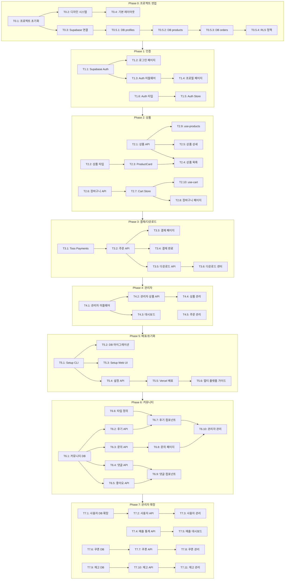

# TASKS: Vibe Store

> 라이브 코딩 콘텐츠용 디지털 상품 쇼핑몰 스캘레톤

## 메타

- **스택**: Next.js 15 + Supabase + Toss Payments
- **배포**: Vercel, Docker, Railway, Render 등 다양한 플랫폼 지원
- **태스크**: 69개 (P0: 11, P1: 6, P2: 12, P3: 6, P4: 7, P5: 6, P6: 10, P7: 11)
- **Top 리스크**: Supabase RLS 보안 정책 설정 복잡도

---

## P0: 프로젝트 셋업 (main 직접)

> Git Worktree 불필요 - main 브랜치에서 직접 작업

### [x] P0-T0.1: 프로젝트 초기화
- **담당**: frontend-specialist
- **작업**: Next.js 16 프로젝트 생성 (App Router, TypeScript, Tailwind CSS)
- **산출물**: `package.json`, `tsconfig.json`, `tailwind.config.ts`
- **Worktree**: ❌ (main 직접)

### [x] P0-T0.2: 디자인 시스템 설정
- **담당**: frontend-specialist
- **작업**: shadcn/ui 설치, 커스텀 컬러 설정 (Vibe Blue/Violet/Amber)
- **산출물**: `components/ui/*`, `tailwind.config.ts` 업데이트
- **Worktree**: ❌ (main 직접)

### [x] P0-T0.3: Supabase 프로젝트 연결
- **담당**: backend-specialist
- **작업**: Supabase 클라이언트 설정 (Browser/Server/Middleware)
- **산출물**: `lib/supabase/client.ts`, `lib/supabase/server.ts`
- **Worktree**: ❌ (main 직접)

### [x] P0-T0.4: 기본 레이아웃 구현
- **담당**: frontend-specialist
- **작업**: Header, Footer, Navigation 컴포넌트
- **산출물**: `components/layout/*`, `app/layout.tsx`
- **Worktree**: ❌ (main 직접)

### [x] P0-T0.5.1: DB 스키마 마이그레이션 - profiles
- **담당**: database-specialist
- **작업**: profiles 테이블 생성, Auth 트리거 설정
- **산출물**: `supabase/migrations/001_create_profiles.sql`
- **Worktree**: ❌ (main 직접)

### [x] P0-T0.5.2: DB 스키마 마이그레이션 - categories
- **담당**: database-specialist
- **작업**: categories 테이블 생성 (계층형 구조, parent_id 자기참조)
- **산출물**: `supabase/migrations/002_create_categories.sql`
- **Worktree**: ❌ (main 직접)

### [x] P0-T0.5.3: DB 스키마 마이그레이션 - products
- **담당**: database-specialist
- **작업**: products 테이블 생성 (slug, category_id FK, is_featured, view_count, sales_count 포함)
- **산출물**: `supabase/migrations/003_create_products.sql`
- **Worktree**: ❌ (main 직접)

### [x] P0-T0.5.4: DB 스키마 마이그레이션 - product_images
- **담당**: database-specialist
- **작업**: product_images 테이블 생성 (다중 이미지 지원, is_primary 플래그)
- **산출물**: `supabase/migrations/004_create_product_images.sql`
- **Worktree**: ❌ (main 직접)

### [x] P0-T0.5.5: DB 스키마 마이그레이션 - product_files, tags
- **담당**: database-specialist
- **작업**: product_files, tags, product_tags 테이블 생성
- **산출물**: `supabase/migrations/005_create_product_files_tags.sql`
- **Worktree**: ❌ (main 직접)

### [x] P0-T0.5.6: DB 스키마 마이그레이션 - orders
- **담당**: database-specialist
- **작업**: cart_items, orders, order_items, downloads 테이블 생성
- **산출물**: `supabase/migrations/006_create_orders.sql`
- **Worktree**: ❌ (main 직접)

### [x] P0-T0.5.7: RLS 정책 및 함수 설정
- **담당**: database-specialist
- **작업**: 모든 테이블 RLS 활성화, 정책 생성, 주문번호/다운로드 권한/조회수 함수
- **산출물**: `supabase/migrations/007_create_rls_policies.sql`
- **Worktree**: ❌ (main 직접)

---

## P1: FEAT-0 인증 시스템

> Worktree: `worktree/phase-1-auth`

### [x] P1-T1.1: Supabase Auth 설정
- **담당**: backend-specialist
- **파일**: `tests/integration/auth.test.ts` → `lib/supabase/auth.ts`
- **스펙**: Google OAuth 설정, 이메일 매직 링크 설정
- **AC**: 2가지 로그인 방식 동작 확인
- **Worktree**: `worktree/phase-1-auth`
- **TDD**: RED → GREEN → REFACTOR
- **병렬**: 독립 실행

### [x] P1-T1.2: 로그인 페이지 구현
- **담당**: frontend-specialist
- **의존**: T1.1 (Mock: `mockSupabaseAuth`)
- **파일**: `tests/components/LoginPage.test.tsx` → `app/(shop)/login/page.tsx`
- **스펙**: 소셜 로그인 버튼, 이메일 입력 폼, 에러 표시
- **AC**: 반응형 (모바일/데스크탑), 로딩 상태 표시
- **Worktree**: `worktree/phase-1-auth`
- **TDD**: RED → GREEN → REFACTOR
- **병렬**: T1.1과 병렬 가능 (Mock 사용)
- **데모**: `app/demo/phase-1/t1-2-login-page/page.tsx`
- **데모 상태**: default, loading, error, success-redirect

### [x] P1-T1.3: Auth 미들웨어 구현
- **담당**: backend-specialist
- **파일**: `tests/middleware/auth.test.ts` → `middleware.ts`
- **스펙**: 세션 갱신, 보호된 라우트 리다이렉트
- **AC**: /my/*, /admin/* 접근 시 로그인 체크
- **Worktree**: `worktree/phase-1-auth`
- **TDD**: RED → GREEN → REFACTOR
- **병렬**: T1.2와 병렬 가능

### [x] P1-T1.4: 프로필 관리 페이지
- **담당**: frontend-specialist
- **의존**: T1.3
- **파일**: `tests/components/ProfilePage.test.tsx` → `app/(shop)/my/page.tsx`
- **스펙**: 프로필 조회, 닉네임 수정
- **AC**: 로그아웃 버튼 동작
- **Worktree**: `worktree/phase-1-auth`
- **TDD**: RED → GREEN → REFACTOR
- **병렬**: 선행 완료 후 실행
- **데모**: `app/demo/phase-1/t1-4-profile-page/page.tsx`
- **데모 상태**: loading, user-info, edit-mode

### [x] P1-T1.5: Auth Store (Zustand)
- **담당**: frontend-specialist
- **파일**: `tests/stores/auth-store.test.ts` → `stores/auth-store.ts`
- **스펙**: 사용자 상태 관리, 로그인/로그아웃 액션
- **AC**: 새로고침 후에도 상태 유지
- **Worktree**: `worktree/phase-1-auth`
- **TDD**: RED → GREEN → REFACTOR
- **병렬**: T1.2와 병렬 가능

### [x] P1-T1.6: Auth 타입 정의
- **담당**: frontend-specialist
- **파일**: `types/auth.ts`
- **스펙**: User, Profile, AuthState 타입
- **산출물**: Zod 스키마 포함
- **Worktree**: `worktree/phase-1-auth`
- **TDD**: RED → GREEN → REFACTOR
- **병렬**: 독립 실행

---

## P2: FEAT-1 상품 기능

> Worktree: `worktree/phase-2-products`

### [x] P2-T2.0: 카테고리 API
- **담당**: backend-specialist
- **파일**: `tests/api/categories.test.ts` → `app/api/categories/route.ts`
- **스펙**: GET 카테고리 트리 (계층형), GET [slug]별 상품 목록
- **AC**: 비활성 카테고리 제외, 상품 수 포함
- **Worktree**: `worktree/phase-2-products`
- **TDD**: RED → GREEN → REFACTOR
- **병렬**: 독립 실행

### [x] P2-T2.1: 상품 API - 목록/상세 조회
- **담당**: backend-specialist
- **파일**: `tests/api/products.test.ts` → `app/api/products/route.ts`
- **스펙**: GET 목록 (페이지네이션, 필터, 정렬), GET [slug] 상세
- **AC**: 페이지당 12개, status=active만 노출, 정렬옵션(인기순/최신순/가격순)
- **Worktree**: `worktree/phase-2-products`
- **TDD**: RED → GREEN → REFACTOR
- **병렬**: 독립 실행

### [x] P2-T2.2: 상품/카테고리 타입 정의
- **담당**: frontend-specialist
- **파일**: `types/product.ts`, `types/category.ts`
- **스펙**: Product, ProductImage, ProductFile, Category, ProductMetadata 타입
- **산출물**: Zod 스키마 포함, slug 유효성 검증
- **Worktree**: `worktree/phase-2-products`
- **TDD**: RED → GREEN → REFACTOR
- **병렬**: 독립 실행

### [x] P2-T2.3: ProductCard 컴포넌트
- **담당**: frontend-specialist
- **의존**: T2.2
- **파일**: `tests/components/ProductCard.test.tsx` → `components/products/product-card.tsx`
- **스펙**: 썸네일, 상품명, 가격, 할인가 표시
- **AC**: 호버 효과, 할인율 계산 표시
- **Worktree**: `worktree/phase-2-products`
- **TDD**: RED → GREEN → REFACTOR
- **병렬**: T2.1과 병렬 가능 (Mock 사용)
- **데모**: `app/demo/phase-2/t2-3-product-card/page.tsx`
- **데모 상태**: default, discount, no-image, long-title

### [x] P2-T2.4: 상품 목록 페이지
- **담당**: frontend-specialist
- **의존**: T2.0, T2.1, T2.3
- **파일**: `tests/pages/ProductsPage.test.tsx` → `app/(shop)/products/page.tsx`
- **스펙**: 그리드 레이아웃, 카테고리 필터, 정렬 옵션, 무한 스크롤/페이지네이션
- **AC**: 반응형 그리드 (1/2/3/4 cols), 정렬(인기순/최신순/가격순)
- **Worktree**: `worktree/phase-2-products`
- **TDD**: RED → GREEN → REFACTOR
- **병렬**: 선행 완료 후 실행
- **데모**: `app/demo/phase-2/t2-4-products-page/page.tsx`
- **데모 상태**: loading, empty, with-products, filtered, sorted

### [x] P2-T2.5: 이미지 갤러리 컴포넌트
- **담당**: frontend-specialist
- **의존**: T2.2
- **파일**: `tests/components/ImageGallery.test.tsx` → `components/products/image-gallery.tsx`
- **스펙**: 다중 이미지 갤러리 (썸네일 + 메인 이미지)
- **AC**: 이미지 전환, 줌 기능, 반응형
- **Worktree**: `worktree/phase-2-products`
- **TDD**: RED → GREEN → REFACTOR
- **병렬**: T2.3과 병렬 가능
- **데모**: `app/demo/phase-2/t2-5-image-gallery/page.tsx`
- **데모 상태**: single-image, multiple-images, zoom

### [x] P2-T2.6: 상품 상세 페이지
- **담당**: frontend-specialist
- **의존**: T2.1, T2.5
- **파일**: `tests/pages/ProductDetailPage.test.tsx` → `app/(shop)/products/[slug]/page.tsx`
- **스펙**: 상품 정보, 이미지 갤러리, 미리보기, 장바구니 담기 버튼
- **AC**: slug 기반 라우팅, Markdown 설명 렌더링, 파일 정보 표시
- **Worktree**: `worktree/phase-2-products`
- **TDD**: RED → GREEN → REFACTOR
- **병렬**: T2.4와 병렬 가능
- **데모**: `app/demo/phase-2/t2-6-product-detail/page.tsx`
- **데모 상태**: loading, digital-product, discount, multi-image

### [x] P2-T2.7: 장바구니 API
- **담당**: backend-specialist
- **파일**: `tests/api/cart.test.ts` → `app/api/cart/route.ts`
- **스펙**: GET/POST/PATCH/DELETE 장바구니 아이템
- **AC**: 회원/비회원 구분 (user_id vs session_id)
- **Worktree**: `worktree/phase-2-products`
- **TDD**: RED → GREEN → REFACTOR
- **병렬**: T2.1과 병렬 가능

### [x] P2-T2.8: Cart Store (Zustand)
- **담당**: frontend-specialist
- **의존**: T2.6 (Mock: `mockCartAPI`)
- **파일**: `tests/stores/cart-store.test.ts` → `stores/cart-store.ts`
- **스펙**: 장바구니 상태 관리, CRUD 액션
- **AC**: 낙관적 업데이트, 에러 롤백
- **Worktree**: `worktree/phase-2-products`
- **TDD**: RED → GREEN → REFACTOR
- **병렬**: T2.6과 병렬 가능 (Mock 사용)

### [x] P2-T2.9: 장바구니 페이지
- **담당**: frontend-specialist
- **의존**: T2.7
- **파일**: `tests/pages/CartPage.test.tsx` → `app/(shop)/cart/page.tsx`
- **스펙**: 상품 목록, 수량 변경, 삭제, 총액 계산
- **AC**: 빈 장바구니 안내, 결제하기 버튼
- **Worktree**: `worktree/phase-2-products`
- **TDD**: RED → GREEN → REFACTOR
- **병렬**: 선행 완료 후 실행
- **데모**: `app/demo/phase-2/t2-8-cart-page/page.tsx`
- **데모 상태**: loading, empty, with-items, updating

### [x] P2-T2.10: use-products 훅
- **담당**: frontend-specialist
- **파일**: `tests/hooks/use-products.test.ts` → `hooks/use-products.ts`
- **스펙**: 상품 목록/상세 데이터 페칭
- **AC**: SWR/React Query 패턴, 캐싱
- **Worktree**: `worktree/phase-2-products`
- **TDD**: RED → GREEN → REFACTOR
- **병렬**: T2.1과 병렬 가능

### [x] P2-T2.11: use-cart 훅
- **담당**: frontend-specialist
- **의존**: T2.7
- **파일**: `tests/hooks/use-cart.test.ts` → `hooks/use-cart.ts`
- **스펙**: 장바구니 조작 훅 (add, remove, update)
- **AC**: Toast 알림 연동
- **Worktree**: `worktree/phase-2-products`
- **TDD**: RED → GREEN → REFACTOR
- **병렬**: T2.7과 병렬 가능

---

## P3: FEAT-1 결제/다운로드

> Worktree: `worktree/phase-3-checkout`

### [x] P3-T3.1: Toss Payments 연동
- **담당**: backend-specialist
- **파일**: `tests/lib/toss.test.ts` → `lib/toss/payments.ts`
- **스펙**: 결제 요청, 결제 승인 API, 웹훅 처리
- **AC**: 테스트 모드 동작 확인
- **Worktree**: `worktree/phase-3-checkout`
- **TDD**: RED → GREEN → REFACTOR
- **병렬**: 독립 실행

### [x] P3-T3.2: 주문 API
- **담당**: backend-specialist
- **의존**: T3.1
- **파일**: `tests/api/orders.test.ts` → `app/api/orders/route.ts`
- **스펙**: 주문 생성, 주문 조회, 결제 상태 업데이트
- **AC**: 주문번호 자동 생성 (ORD-YYYYMMDD-XXXX)
- **Worktree**: `worktree/phase-3-checkout`
- **TDD**: RED → GREEN → REFACTOR
- **병렬**: T3.1과 병렬 가능 (Mock 사용)

### [x] P3-T3.3: 결제 페이지
- **담당**: frontend-specialist
- **의존**: T3.1, T3.2
- **파일**: `tests/pages/CheckoutPage.test.tsx` → `app/(shop)/checkout/page.tsx`
- **스펙**: 주문 요약, 비회원 이메일 입력, 토스 결제 SDK 연동
- **AC**: 결제 성공/실패 처리
- **Worktree**: `worktree/phase-3-checkout`
- **TDD**: RED → GREEN → REFACTOR
- **병렬**: 선행 완료 후 실행
- **데모**: `app/demo/phase-3/t3-3-checkout-page/page.tsx`
- **데모 상태**: loading, order-summary, guest-mode, processing

### [x] P3-T3.4: 결제 완료 페이지
- **담당**: frontend-specialist
- **의존**: T3.2
- **파일**: `tests/pages/CheckoutSuccessPage.test.tsx` → `app/(shop)/checkout/success/page.tsx`
- **스펙**: 주문 확인, 다운로드 센터 안내
- **AC**: 회원 전환 유도 (비회원일 때)
- **Worktree**: `worktree/phase-3-checkout`
- **TDD**: RED → GREEN → REFACTOR
- **병렬**: T3.3과 병렬 가능
- **데모**: `app/demo/phase-3/t3-4-checkout-success/page.tsx`
- **데모 상태**: success, guest-convert-prompt

### [x] P3-T3.5: 다운로드 API
- **담당**: backend-specialist
- **파일**: `tests/api/downloads.test.ts` → `app/api/downloads/[id]/route.ts`
- **스펙**: Signed URL 생성, 다운로드 횟수 검증
- **AC**: 만료/횟수 초과 시 에러
- **Worktree**: `worktree/phase-3-checkout`
- **TDD**: RED → GREEN → REFACTOR
- **병렬**: T3.2와 병렬 가능

### [x] P3-T3.6: 다운로드 센터 페이지
- **담당**: frontend-specialist
- **의존**: T3.5
- **파일**: `tests/pages/DownloadsPage.test.tsx` → `app/(shop)/my/downloads/page.tsx`
- **스펙**: 구매 상품 목록, 다운로드 버튼, 남은 횟수/기간 표시
- **AC**: 만료된 다운로드 비활성화
- **Worktree**: `worktree/phase-3-checkout`
- **TDD**: RED → GREEN → REFACTOR
- **병렬**: 선행 완료 후 실행
- **데모**: `app/demo/phase-3/t3-6-downloads-page/page.tsx`
- **데모 상태**: loading, empty, with-downloads, expired

---

## P4: FEAT-2 관리자 기능

> Worktree: `worktree/phase-4-admin`

### [x] P4-T4.1: 관리자 권한 미들웨어
- **담당**: backend-specialist
- **파일**: `tests/middleware/admin.test.ts` → `lib/middleware/admin.ts`
- **스펙**: role=admin 체크, /admin/* 접근 제어
- **AC**: 비관리자 접근 시 403
- **Worktree**: `worktree/phase-4-admin`
- **TDD**: RED → GREEN → REFACTOR
- **병렬**: 독립 실행

### [x] P4-T4.2: 관리자 카테고리 API
- **담당**: backend-specialist
- **의존**: T4.1
- **파일**: `tests/api/admin/categories.test.ts` → `app/api/admin/categories/route.ts`
- **스펙**: 카테고리 CRUD, 순서 변경, 계층 구조 관리
- **AC**: 하위 카테고리 있으면 삭제 방지
- **Worktree**: `worktree/phase-4-admin`
- **TDD**: RED → GREEN → REFACTOR
- **병렬**: T4.1과 병렬 가능 (Mock 사용)

### [x] P4-T4.3: 관리자 상품 API
- **담당**: backend-specialist
- **의존**: T4.1
- **파일**: `tests/api/admin/products.test.ts` → `app/api/admin/products/route.ts`
- **스펙**: 상품 CRUD (생성, 수정, 삭제), 다중 이미지 업로드, 파일 업로드
- **AC**: Soft delete, Storage 업로드, 슬러그 자동생성
- **Worktree**: `worktree/phase-4-admin`
- **TDD**: RED → GREEN → REFACTOR
- **병렬**: T4.2와 병렬 가능

### [x] P4-T4.4: 관리자 대시보드
- **담당**: frontend-specialist
- **의존**: T4.1
- **파일**: `tests/pages/AdminDashboard.test.tsx` → `app/admin/page.tsx`
- **스펙**: 주문 현황, 매출 요약, 최근 주문 목록
- **AC**: 간단한 통계 카드
- **Worktree**: `worktree/phase-4-admin`
- **TDD**: RED → GREEN → REFACTOR
- **병렬**: T4.2와 병렬 가능
- **데모**: `app/demo/phase-4/t4-3-admin-dashboard/page.tsx`
- **데모 상태**: loading, with-data, empty-state

### [x] P4-T4.5: 카테고리 관리 페이지
- **담당**: frontend-specialist
- **의존**: T4.2
- **파일**: `tests/pages/AdminCategoriesPage.test.tsx` → `app/admin/categories/page.tsx`
- **스펙**: 카테고리 트리 뷰, 드래그 앤 드롭 순서 변경, 등록/수정 폼
- **AC**: 계층 구조 시각화, 활성/비활성 토글
- **Worktree**: `worktree/phase-4-admin`
- **TDD**: RED → GREEN → REFACTOR
- **병렬**: T4.4와 병렬 가능
- **데모**: `app/demo/phase-4/t4-5-admin-categories/page.tsx`
- **데모 상태**: list, create, edit, reorder

### [x] P4-T4.6: 상품 관리 페이지
- **담당**: frontend-specialist
- **의존**: T4.2
- **파일**: `tests/pages/AdminProductsPage.test.tsx` → `app/admin/products/page.tsx`
- **스펙**: 상품 목록, 등록/수정 폼, 파일 업로드
- **AC**: 상태 변경 (draft/active/hidden)
- **Worktree**: `worktree/phase-4-admin`
- **TDD**: RED → GREEN → REFACTOR
- **병렬**: T4.3과 병렬 가능
- **데모**: `app/demo/phase-4/t4-4-admin-products/page.tsx`
- **데모 상태**: list, create-form, edit-form, file-upload

### [x] P4-T4.7: 주문 관리 페이지
- **담당**: frontend-specialist
- **파일**: `tests/pages/AdminOrdersPage.test.tsx` → `app/admin/orders/page.tsx`
- **스펙**: 주문 목록, 상세 조회, 상태 변경
- **AC**: 필터 (상태별), 검색 (주문번호)
- **Worktree**: `worktree/phase-4-admin`
- **TDD**: RED → GREEN → REFACTOR
- **병렬**: T4.4와 병렬 가능
- **데모**: `app/demo/phase-4/t4-5-admin-orders/page.tsx`
- **데모 상태**: list, detail, filter, empty

---

## P5: 배포 및 초기 설정

> Worktree: `worktree/phase-5-deploy`

### [x] P5-T5.1: Setup Wizard CLI 스크립트
- **담당**: backend-specialist
- **파일**: `scripts/setup-wizard.ts`, `scripts/setup/index.ts`
- **스펙**:
  - 인터랙티브 CLI 위저드 (inquirer.js 또는 prompts 사용)
  - Supabase URL 및 ANON_KEY 입력
  - Toss Payments 키 입력 (선택)
  - 사이트 기본 정보 입력 (상점명, URL, 관리자 이메일)
- **산출물**:
  - `.env.local` 생성 (민감 정보, gitignore됨)
  - `config/site.config.ts` 생성 (공개 설정)
- **AC**: `npm run setup` 명령으로 실행
- **Worktree**: `worktree/phase-5-deploy`
- **TDD**: RED → GREEN → REFACTOR
- **병렬**: 독립 실행

### [x] P5-T5.2: DB 자동 마이그레이션 스크립트
- **담당**: database-specialist
- **의존**: T5.1
- **파일**: `scripts/migrate.ts`, `scripts/seed.ts`
- **스펙**:
  - Supabase 키 검증 후 연결 테스트
  - 모든 마이그레이션 SQL 순차 실행
  - 초기 시드 데이터 삽입 (샘플 카테고리, 상품)
  - 실행 결과 로깅
- **산출물**: `supabase/migrations/*.sql` 실행
- **AC**:
  - `npm run db:migrate` - 마이그레이션만
  - `npm run db:seed` - 시드 데이터 추가
  - `npm run db:reset` - 전체 초기화
- **Worktree**: `worktree/phase-5-deploy`
- **TDD**: RED → GREEN → REFACTOR
- **병렬**: T5.1 완료 후

### [x] P5-T5.3: Setup Wizard Web UI
- **담당**: frontend-specialist
- **의존**: T5.1
- **파일**: `app/setup/page.tsx`, `app/setup/layout.tsx`
- **스펙**:
  - 단계별 폼 UI (스텝 위저드)
  - Step 1: Supabase 설정 (URL, ANON_KEY 입력, 연결 테스트)
  - Step 2: 결제 설정 (Toss 키, 선택사항)
  - Step 3: 사이트 정보 (상점명, 로고, 관리자)
  - Step 4: 완료 및 DB 초기화 실행
- **산출물**:
  - 설정 완료 후 `/admin`으로 리다이렉트
  - 이미 설정된 경우 접근 차단
- **AC**:
  - 각 스텝 유효성 검증
  - 연결 테스트 성공 시 다음 스텝 진행
  - 진행 상태 표시
- **Worktree**: `worktree/phase-5-deploy`
- **TDD**: RED → GREEN → REFACTOR
- **병렬**: T5.2와 병렬 가능
- **데모**: `app/demo/phase-5/t5-3-setup-wizard/page.tsx`
- **데모 상태**: step-1, step-2, step-3, step-4, complete, already-configured

### [x] P5-T5.4: 설정 API 및 보안 저장소
- **담당**: backend-specialist
- **의존**: T5.1
- **파일**:
  - `app/api/setup/route.ts` - 설정 저장 API
  - `app/api/setup/test-connection/route.ts` - 연결 테스트
  - `lib/config/secure-store.ts` - 보안 설정 관리
- **스펙**:
  - 환경변수 유효성 검증
  - Supabase 연결 테스트 API
  - 설정 암호화 저장 옵션 (AES-256)
- **보안 옵션**:
  - 기본: `.env.local` (권장, 간단)
  - 고급: 암호화된 `config/secrets.enc` + 마스터 키
- **AC**:
  - 잘못된 키 입력 시 명확한 에러 메시지
  - 설정 완료 여부 확인 API
- **Worktree**: `worktree/phase-5-deploy`
- **TDD**: RED → GREEN → REFACTOR
- **병렬**: T5.3과 병렬 가능

### [x] P5-T5.5: Vercel 배포 스크립트
- **담당**: backend-specialist
- **파일**:
  - `scripts/deploy-vercel.ts` - 배포 스크립트
  - `vercel.json` - Vercel 설정
  - `.github/workflows/deploy.yml` - CI/CD (선택)
- **스펙**:
  - Vercel CLI 설치 확인 및 안내
  - 프로젝트 연결 (`vercel link`)
  - 환경변수 설정 안내/자동화
  - 프로덕션 배포 (`vercel --prod`)
- **산출물**:
  - `npm run deploy:vercel` 명령
  - 배포 URL 출력
- **AC**:
  - Vercel 계정 연결 가이드
  - 환경변수 누락 경고
  - 배포 성공/실패 상태 표시
- **Worktree**: `worktree/phase-5-deploy`
- **TDD**: RED → GREEN → REFACTOR
- **병렬**: T5.4 완료 후

### [x] P5-T5.6: 멀티 플랫폼 배포 가이드
- **담당**: docs-specialist
- **파일**:
  - `docs/deployment/vercel.md`
  - `docs/deployment/docker.md`
  - `docs/deployment/railway.md`
  - `Dockerfile`, `docker-compose.yml`
- **스펙**:
  - Vercel 배포 상세 가이드
  - Docker 이미지 빌드 및 실행
  - Railway/Render 원클릭 배포 버튼
  - 환경변수 설정 체크리스트
- **산출물**:
  - `npm run build:docker` 명령
  - README에 배포 옵션 요약
- **AC**:
  - 각 플랫폼별 단계별 가이드
  - 트러블슈팅 FAQ
- **Worktree**: `worktree/phase-5-deploy`
- **병렬**: T5.5와 병렬 가능

---

## P6: 커뮤니티 기능 (후기/문의)

> Worktree: `worktree/phase-6-community`

### [x] P6-T6.1: 커뮤니티 DB 스키마
- **담당**: database-specialist
- **파일**: `supabase/migrations/008_create_reviews.sql`, `009_create_inquiries.sql`, `010_create_comments_likes.sql`
- **스펙**:
  - `reviews` 테이블: product_id, user_id, order_item_id (구매 검증), rating(1-5), title, content, images(JSONB), like_count, view_count, is_best
  - `inquiries` 테이블: product_id(nullable), user_id, category(상품/배송/결제/기타), title, content, is_private, status(pending/answered), view_count
  - `comments` 테이블: commentable_type, commentable_id, parent_id(대댓글), user_id, content, like_count
  - `likes` 테이블: likeable_type, likeable_id, user_id (다형성 좋아요)
- **산출물**: 마이그레이션 SQL, RLS 정책
- **AC**:
  - 후기는 구매자만 작성 가능 (order_item_id 검증)
  - 비밀 문의는 작성자/관리자만 조회
  - 좋아요 중복 방지 (UNIQUE 제약)
- **Worktree**: `worktree/phase-6-community`
- **TDD**: RED → GREEN → REFACTOR
- **병렬**: 독립 실행

### [x] P6-T6.2: 후기 API
- **담당**: backend-specialist
- **의존**: T6.1
- **파일**: `tests/api/reviews.test.ts` → `app/api/reviews/route.ts`, `app/api/products/[slug]/reviews/route.ts`
- **스펙**:
  - GET: 상품별 후기 목록 (정렬: 최신/좋아요순/별점순)
  - POST: 후기 작성 (구매 검증, 이미지 업로드)
  - PATCH: 후기 수정 (본인만)
  - DELETE: 후기 삭제 (본인/관리자)
- **AC**:
  - 이미지 최대 5장
  - 평균 별점 계산 함수
  - 베스트 리뷰 선정 (관리자)
- **Worktree**: `worktree/phase-6-community`
- **TDD**: RED → GREEN → REFACTOR
- **병렬**: T6.1 완료 후

### [x] P6-T6.3: 문의 API
- **담당**: backend-specialist
- **의존**: T6.1
- **파일**: `tests/api/inquiries.test.ts` → `app/api/inquiries/route.ts`
- **스펙**:
  - GET: 문의 목록 (비밀글 필터링)
  - POST: 문의 작성
  - PATCH: 문의 수정/답변 (관리자)
  - DELETE: 문의 삭제
- **AC**:
  - 비밀글은 작성자/관리자만 조회
  - 답변 시 status 자동 변경
  - 이메일 알림 옵션
- **Worktree**: `worktree/phase-6-community`
- **TDD**: RED → GREEN → REFACTOR
- **병렬**: T6.2와 병렬 가능

### [x] P6-T6.4: 댓글/대댓글 API
- **담당**: backend-specialist
- **의존**: T6.1
- **파일**: `tests/api/comments.test.ts` → `app/api/comments/route.ts`
- **스펙**:
  - GET: 댓글 목록 (대댓글 포함, 트리 구조)
  - POST: 댓글/대댓글 작성
  - PATCH: 댓글 수정
  - DELETE: 댓글 삭제 (하위 댓글 있으면 "삭제된 댓글" 표시)
- **AC**:
  - 다형성: reviews, inquiries에 공통 적용
  - 대댓글 1단계만 허용
  - 작성자 프로필 정보 포함
- **Worktree**: `worktree/phase-6-community`
- **TDD**: RED → GREEN → REFACTOR
- **병렬**: T6.2, T6.3과 병렬 가능

### [x] P6-T6.5: 좋아요 API
- **담당**: backend-specialist
- **의존**: T6.1
- **파일**: `tests/api/likes.test.ts` → `app/api/likes/route.ts`
- **스펙**:
  - POST: 좋아요 토글 (추가/취소)
  - GET: 좋아요 상태 확인
- **AC**:
  - 다형성: reviews, comments에 공통 적용
  - 낙관적 업데이트 지원
  - like_count 자동 갱신 트리거
- **Worktree**: `worktree/phase-6-community`
- **TDD**: RED → GREEN → REFACTOR
- **병렬**: T6.4와 병렬 가능

### [x] P6-T6.6: 커뮤니티 타입 정의
- **담당**: frontend-specialist
- **파일**: `types/review.ts`, `types/inquiry.ts`, `types/comment.ts`
- **스펙**: Review, Inquiry, Comment, Like 타입
- **산출물**: Zod 스키마 포함
- **Worktree**: `worktree/phase-6-community`
- **TDD**: RED → GREEN → REFACTOR
- **병렬**: 독립 실행

### [x] P6-T6.7: 상품 후기 컴포넌트
- **담당**: frontend-specialist
- **의존**: T6.2, T6.6
- **파일**: `tests/components/ProductReviews.test.tsx` → `components/reviews/product-reviews.tsx`
- **스펙**:
  - 후기 목록 (별점 분포, 평균)
  - 후기 작성 폼 (별점, 이미지 업로드)
  - 후기 카드 (좋아요, 댓글)
- **AC**:
  - 이미지 갤러리/라이트박스
  - 무한 스크롤
  - 정렬 옵션
- **Worktree**: `worktree/phase-6-community`
- **TDD**: RED → GREEN → REFACTOR
- **병렬**: T6.5 완료 후
- **데모**: `app/demo/phase-6/t6-7-product-reviews/page.tsx`
- **데모 상태**: empty, with-reviews, write-form, with-images

### [x] P6-T6.8: 문의 게시판 페이지
- **담당**: frontend-specialist
- **의존**: T6.3, T6.6
- **파일**: `tests/pages/InquiriesPage.test.tsx` → `app/(shop)/inquiries/page.tsx`, `app/(shop)/products/[slug]/inquiries/page.tsx`
- **스펙**:
  - 문의 목록 (카테고리 필터, 상태 필터)
  - 문의 작성 폼 (비밀글 옵션)
  - 문의 상세 (답변 표시)
- **AC**:
  - 비밀글 아이콘 표시
  - 답변 완료/대기 상태 표시
  - 조회수 표시
- **Worktree**: `worktree/phase-6-community`
- **TDD**: RED → GREEN → REFACTOR
- **병렬**: T6.7과 병렬 가능
- **데모**: `app/demo/phase-6/t6-8-inquiries-page/page.tsx`
- **데모 상태**: list, detail, write-form, private, answered

### [x] P6-T6.9: 댓글 컴포넌트
- **담당**: frontend-specialist
- **의존**: T6.4, T6.5, T6.6
- **파일**: `tests/components/Comments.test.tsx` → `components/comments/comment-list.tsx`, `components/comments/comment-form.tsx`
- **스펙**:
  - 댓글 목록 (대댓글 접기/펼치기)
  - 댓글 작성/수정 폼
  - 좋아요 버튼
- **AC**:
  - 대댓글 들여쓰기
  - 삭제된 댓글 처리
  - 낙관적 업데이트
- **Worktree**: `worktree/phase-6-community`
- **TDD**: RED → GREEN → REFACTOR
- **병렬**: T6.7, T6.8과 병렬 가능
- **데모**: `app/demo/phase-6/t6-9-comments/page.tsx`
- **데모 상태**: empty, with-comments, with-replies, editing

### [x] P6-T6.10: 관리자 후기/문의 관리
- **담당**: frontend-specialist
- **의존**: T6.2, T6.3
- **파일**: `tests/pages/AdminReviewsPage.test.tsx` → `app/admin/reviews/page.tsx`, `app/admin/inquiries/page.tsx`
- **스펙**:
  - 후기 관리 (베스트 선정, 삭제, 신고 처리)
  - 문의 관리 (답변 작성, 상태 변경)
- **AC**:
  - 필터 (상태, 기간, 별점)
  - 일괄 처리
  - 답변 템플릿
- **Worktree**: `worktree/phase-6-community`
- **TDD**: RED → GREEN → REFACTOR
- **병렬**: T6.9 완료 후
- **데모**: `app/demo/phase-6/t6-10-admin-community/page.tsx`
- **데모 상태**: reviews-list, inquiries-list, answer-form, bulk-action

---

## P7: 관리자 확장 기능

> Worktree: `worktree/phase-7-admin-extended`

### [x] P7-T7.1: 사용자 관리 DB 스키마 확장
- **담당**: database-specialist
- **파일**: `supabase/migrations/011_extend_profiles.sql`
- **스펙**:
  - `profiles` 테이블 확장: grade(등급), points(적립금), is_blocked, blocked_reason, last_login_at
  - `user_grades` 테이블: 등급 정의 (bronze/silver/gold/vip), 할인율, 적립율
- **산출물**: 마이그레이션 SQL, RLS 정책
- **AC**: 등급별 혜택 적용 가능
- **Worktree**: `worktree/phase-7-admin-extended`
- **TDD**: RED → GREEN → REFACTOR
- **병렬**: 독립 실행

### [x] P7-T7.2: 사용자 관리 API
- **담당**: backend-specialist
- **의존**: T7.1
- **파일**: `tests/api/admin/users.test.ts` → `app/api/admin/users/route.ts`
- **스펙**:
  - GET: 회원 목록 (검색, 필터, 페이지네이션)
  - GET [id]: 회원 상세 (주문 이력, 후기, 문의 포함)
  - PATCH: 회원 정보 수정 (등급, 차단, 메모)
  - POST: 적립금 지급/차감
- **AC**:
  - 등급 변경 시 이력 저장
  - 차단 시 로그인 불가
  - 주문/후기/문의 통계 포함
- **Worktree**: `worktree/phase-7-admin-extended`
- **TDD**: RED → GREEN → REFACTOR
- **병렬**: T7.1 완료 후

### [x] P7-T7.3: 사용자 관리 페이지
- **담당**: frontend-specialist
- **의존**: T7.2
- **파일**: `tests/pages/AdminUsersPage.test.tsx` → `app/admin/users/page.tsx`, `app/admin/users/[id]/page.tsx`
- **스펙**:
  - 회원 목록 (검색, 등급 필터, 상태 필터)
  - 회원 상세 (프로필, 주문 이력, 후기/문의)
  - 등급/차단/메모 수정
  - 적립금 관리
- **AC**:
  - 회원 검색 (이메일, 닉네임)
  - 등급별 색상 구분
  - 주문 이력 바로가기
- **Worktree**: `worktree/phase-7-admin-extended`
- **TDD**: RED → GREEN → REFACTOR
- **병렬**: T7.2 완료 후
- **데모**: `app/demo/phase-7/t7-3-admin-users/page.tsx`
- **데모 상태**: list, detail, edit-grade, block-user, points

### [x] P7-T7.4: 매출 통계 API
- **담당**: backend-specialist
- **파일**: `tests/api/admin/analytics.test.ts` → `app/api/admin/analytics/route.ts`
- **스펙**:
  - GET /summary: 기간별 매출 요약 (일/주/월/년)
  - GET /products: 상품별 매출 순위
  - GET /categories: 카테고리별 매출
  - GET /trends: 매출 추이 (시계열 데이터)
  - GET /export: 엑셀 내보내기
- **AC**:
  - 기간 필터 (시작일~종료일)
  - 비교 기간 지원 (전년/전월 대비)
  - CSV/Excel 다운로드
- **Worktree**: `worktree/phase-7-admin-extended`
- **TDD**: RED → GREEN → REFACTOR
- **병렬**: 독립 실행

### [x] P7-T7.5: 매출 통계 대시보드
- **담당**: frontend-specialist
- **의존**: T7.4
- **파일**: `tests/pages/AdminAnalyticsPage.test.tsx` → `app/admin/analytics/page.tsx`
- **스펙**:
  - 매출 현황 카드 (오늘/이번 주/이번 달/전체)
  - 매출 추이 차트 (Line Chart)
  - 상품별 매출 순위 (Bar Chart)
  - 카테고리별 비중 (Pie Chart)
  - 기간 선택기 (DateRangePicker)
  - 엑셀 내보내기 버튼
- **AC**:
  - 실시간 데이터 갱신
  - 반응형 차트
  - 전기 대비 증감률 표시
- **Worktree**: `worktree/phase-7-admin-extended`
- **TDD**: RED → GREEN → REFACTOR
- **병렬**: T7.4 완료 후
- **데모**: `app/demo/phase-7/t7-5-admin-analytics/page.tsx`
- **데모 상태**: dashboard, date-filter, export, compare

### [x] P7-T7.6: 쿠폰/할인 DB 스키마
- **담당**: database-specialist
- **파일**: `supabase/migrations/012_create_coupons.sql`
- **스펙**:
  - `coupons` 테이블: code, name, type(percent/fixed/free_shipping), value, min_order_amount, max_discount, start_at, end_at, usage_limit, used_count, is_active
  - `coupon_usages` 테이블: coupon_id, user_id, order_id, discount_amount, used_at
  - `user_coupons` 테이블: user_id, coupon_id, issued_at, expires_at, is_used
- **산출물**: 마이그레이션 SQL, RLS 정책
- **AC**:
  - 쿠폰 중복 사용 방지
  - 사용 횟수 제한
  - 최소 주문금액/최대 할인금액 검증
- **Worktree**: `worktree/phase-7-admin-extended`
- **TDD**: RED → GREEN → REFACTOR
- **병렬**: 독립 실행

### [x] P7-T7.7: 쿠폰/할인 API
- **담당**: backend-specialist
- **의존**: T7.6
- **파일**: `tests/api/admin/coupons.test.ts` → `app/api/admin/coupons/route.ts`, `app/api/coupons/route.ts`
- **스펙**:
  - 관리자 API:
    - CRUD: 쿠폰 생성/조회/수정/삭제
    - POST /issue: 쿠폰 발급 (특정 사용자/대량 발급)
  - 사용자 API:
    - GET /my: 내 쿠폰 목록
    - POST /apply: 쿠폰 적용 (장바구니/결제 시)
    - POST /validate: 쿠폰 코드 검증
- **AC**:
  - 쿠폰 코드 자동 생성 옵션
  - 유효성 검증 (기간, 사용 횟수, 최소 금액)
  - 할인 금액 계산
- **Worktree**: `worktree/phase-7-admin-extended`
- **TDD**: RED → GREEN → REFACTOR
- **병렬**: T7.6 완료 후

### [x] P7-T7.8: 쿠폰/할인 관리 페이지
- **담당**: frontend-specialist
- **의존**: T7.7
- **파일**: `tests/pages/AdminCouponsPage.test.tsx` → `app/admin/coupons/page.tsx`
- **스펙**:
  - 쿠폰 목록 (상태 필터, 검색)
  - 쿠폰 생성/수정 폼
  - 쿠폰 발급 (개별/대량)
  - 사용 이력 조회
- **AC**:
  - 쿠폰 코드 복사
  - 사용률 표시
  - 만료 임박 알림
- **Worktree**: `worktree/phase-7-admin-extended`
- **TDD**: RED → GREEN → REFACTOR
- **병렬**: T7.7 완료 후
- **데모**: `app/demo/phase-7/t7-8-admin-coupons/page.tsx`
- **데모 상태**: list, create-form, issue, usage-history

### [x] P7-T7.9: 재고 관리 DB 스키마
- **담당**: database-specialist
- **파일**: `supabase/migrations/013_create_inventory.sql`
- **스펙**:
  - `products` 테이블 확장: stock(현재 재고), stock_alert_threshold(알림 기준)
  - `inventory_logs` 테이블: product_id, type(in/out/adjust), quantity, reason, reference_id(order_id 등), created_by, created_at
- **산출물**: 마이그레이션 SQL, 재고 자동 차감 트리거
- **AC**:
  - 주문 시 자동 재고 차감
  - 재고 부족 시 주문 방지
  - 입출고 이력 추적
- **Worktree**: `worktree/phase-7-admin-extended`
- **TDD**: RED → GREEN → REFACTOR
- **병렬**: 독립 실행

### [x] P7-T7.10: 재고 API
- **담당**: backend-specialist
- **의존**: T7.9
- **파일**: `tests/api/admin/inventory.test.ts` → `app/api/admin/inventory/route.ts`
- **스펙**:
  - GET: 재고 현황 목록 (부족 재고 필터)
  - POST /adjust: 재고 조정 (입고/출고/보정)
  - GET /logs: 입출고 이력
  - GET /alerts: 재고 부족 알림 목록
- **AC**:
  - 대량 재고 조정
  - 재고 변동 사유 기록
  - 이메일 알림 (재고 부족 시)
- **Worktree**: `worktree/phase-7-admin-extended`
- **TDD**: RED → GREEN → REFACTOR
- **병렬**: T7.9 완료 후

### [x] P7-T7.11: 재고 관리 페이지
- **담당**: frontend-specialist
- **의존**: T7.10
- **파일**: `tests/pages/AdminInventoryPage.test.tsx` → `app/admin/inventory/page.tsx`
- **스펙**:
  - 재고 현황 목록 (상품별)
  - 재고 부족 알림 배지
  - 재고 조정 폼 (입고/출고)
  - 입출고 이력 조회
- **AC**:
  - 재고 부족 상품 강조
  - 일괄 재고 조정
  - 엑셀 가져오기/내보내기
- **Worktree**: `worktree/phase-7-admin-extended`
- **TDD**: RED → GREEN → REFACTOR
- **병렬**: T7.10 완료 후
- **데모**: `app/demo/phase-7/t7-11-admin-inventory/page.tsx`
- **데모 상태**: list, low-stock, adjust-form, logs

---

## 의존성 그래프

---

## 병렬 실행 가능 그룹

| Phase | 병렬 그룹 | 태스크 | 조건 |
|-------|----------|--------|------|
| P0 | Group 0-A | T0.1 | 선행 없음 |
| P0 | Group 0-B | T0.2, T0.3 | T0.1 완료 후 |
| P0 | Group 0-C | T0.4, T0.5.1 | T0.2/T0.3 완료 후 |
| P0 | Group 0-D | T0.5.2~T0.5.7 | 순차 실행 (DB 의존성) |
| P1 | Group 1-A | T1.1, T1.6 | 독립 실행 |
| P1 | Group 1-B | T1.2, T1.3, T1.5 | T1.1/T1.6 완료 후 (Mock 가능) |
| P2 | Group 2-A | T2.0, T2.1, T2.2, T2.7 | 독립 실행 |
| P2 | Group 2-B | T2.3, T2.5, T2.8, T2.10 | 선행 완료 후 (Mock 가능) |
| P2 | Group 2-C | T2.4, T2.6, T2.9, T2.11 | 선행 완료 후 |
| P3 | Group 3-A | T3.1, T3.5 | 독립 실행 |
| P3 | Group 3-B | T3.2 | T3.1 완료 후 |
| P3 | Group 3-C | T3.3, T3.4, T3.6 | 선행 완료 후 |
| P4 | Group 4-A | T4.1 | 독립 실행 |
| P4 | Group 4-B | T4.2, T4.3, T4.4 | T4.1 완료 후 (Mock 가능) |
| P4 | Group 4-C | T4.5, T4.6, T4.7 | 선행 완료 후 |
| P5 | Group 5-A | T5.1 | 독립 실행 |
| P5 | Group 5-B | T5.2, T5.3, T5.4 | T5.1 완료 후 (병렬 가능) |
| P5 | Group 5-C | T5.5, T5.6 | T5.4 완료 후 (병렬 가능) |
| P6 | Group 6-A | T6.1, T6.6 | 독립 실행 |
| P6 | Group 6-B | T6.2, T6.3, T6.4, T6.5 | T6.1 완료 후 (병렬 가능) |
| P6 | Group 6-C | T6.7, T6.8, T6.9 | T6.2~T6.6 완료 후 (병렬 가능) |
| P6 | Group 6-D | T6.10 | T6.7, T6.8 완료 후 |
| P7 | Group 7-A | T7.1, T7.4, T7.6, T7.9 | 독립 실행 (DB 스키마/API) |
| P7 | Group 7-B | T7.2, T7.7, T7.10 | 각 DB 완료 후 (병렬 가능) |
| P7 | Group 7-C | T7.3, T7.5, T7.8, T7.11 | 각 API 완료 후 (병렬 가능) |

---

## 에이전트 매핑

| 에이전트 | 담당 태스크 |
|----------|------------|
| **frontend-specialist** | T0.1, T0.2, T0.4, T1.2, T1.4, T1.5, T1.6, T2.2, T2.3, T2.4, T2.5, T2.6, T2.8, T2.9, T2.10, T2.11, T3.3, T3.4, T3.6, T4.4, T4.5, T4.6, T4.7, T5.3, T6.6, T6.7, T6.8, T6.9, T6.10, T7.3, T7.5, T7.8, T7.11 |
| **backend-specialist** | T0.3, T1.1, T1.3, T2.0, T2.1, T2.7, T3.1, T3.2, T3.5, T4.1, T4.2, T4.3, T5.1, T5.4, T5.5, T6.2, T6.3, T6.4, T6.5, T7.2, T7.4, T7.7, T7.10 |
| **database-specialist** | T0.5.1, T0.5.2, T0.5.3, T0.5.4, T0.5.5, T0.5.6, T0.5.7, T5.2, T6.1, T7.1, T7.6, T7.9 |
| **docs-specialist** | T5.6 |

---

## Quality Gates

### Phase 0 완료 조건
- [ ] Next.js 프로젝트 실행 확인 (`npm run dev`)
- [ ] shadcn/ui 컴포넌트 렌더링 확인
- [ ] Supabase 연결 확인 (환경변수 설정)
- [ ] 모든 마이그레이션 적용 확인

### Phase 1 완료 조건
- [ ] 3가지 로그인 방식 동작 (Kakao, Google, Magic Link)
- [ ] 보호된 라우트 접근 제어 동작
- [ ] 프로필 조회/수정 동작

### Phase 2 완료 조건
- [ ] 상품 목록 페이지네이션 동작
- [ ] 상품 상세 페이지 렌더링
- [ ] 장바구니 CRUD 동작

### Phase 3 완료 조건
- [ ] 토스 테스트 결제 성공
- [ ] 결제 후 다운로드 권한 생성
- [ ] Signed URL 다운로드 동작

### Phase 4 완료 조건
- [ ] 관리자 접근 제어 동작
- [ ] 상품 등록/수정/삭제 동작
- [ ] 주문 상태 변경 동작

### Phase 5 완료 조건
- [ ] `npm run setup` 위저드 정상 동작
- [ ] Supabase 연결 테스트 통과
- [ ] DB 마이그레이션 자동 실행 성공
- [ ] Setup Web UI 스텝 완료
- [ ] `npm run deploy:vercel` 배포 성공
- [ ] Docker 빌드 및 실행 확인

### Phase 6 완료 조건
- [ ] 상품 후기 작성/조회/좋아요 동작
- [ ] 구매자만 후기 작성 가능 검증
- [ ] 문의 게시판 CRUD 동작
- [ ] 비밀글 접근 제어 동작
- [ ] 댓글/대댓글 작성 동작
- [ ] 관리자 후기/문의 관리 동작

### Phase 7 완료 조건
- [ ] 회원 목록 조회/검색 동작
- [ ] 회원 등급/차단 관리 동작
- [ ] 적립금 지급/차감 동작
- [ ] 매출 통계 차트 렌더링
- [ ] 기간별/상품별 매출 조회
- [ ] 엑셀 내보내기 동작
- [ ] 쿠폰 생성/발급 동작
- [ ] 쿠폰 적용 및 할인 계산
- [ ] 재고 조정 (입고/출고) 동작
- [ ] 재고 부족 알림 동작

---

## Decision Log

- **Phase 번호 규칙**: P0=main 직접, P1+=Worktree 사용
- **TDD 워크플로우**: Phase 1+는 테스트 우선 개발
- **병렬 실행**: Mock 활용으로 의존성 있는 태스크도 병렬 가능
- **데모 페이지**: 프론트엔드 태스크에 DDD 적용
- **RLS 정책**: Phase 0에서 모두 설정하여 보안 기반 확보
- **Setup Wizard**: CLI + Web UI 이중 제공으로 다양한 사용자 지원
- **보안 설정 저장**: 기본은 `.env.local` (간단), 고급은 암호화 파일 옵션
- **배포 스크립트**: Vercel 우선, Docker/Railway/Render 가이드 제공
- **후기 시스템**: 구매 검증 필수 (order_item_id), 이미지 최대 5장, 베스트 리뷰 선정
- **문의 게시판**: 비밀글 지원, 카테고리별 분류, 답변 상태 관리
- **댓글/좋아요**: 다형성 테이블로 후기/문의 공용, 대댓글 1단계만 허용
- **사용자 등급 시스템**: bronze/silver/gold/vip 4단계, 등급별 할인율/적립율 차등
- **매출 통계**: Recharts 라이브러리 활용, 기간별/상품별/카테고리별 분석, CSV/Excel 내보내기
- **쿠폰 시스템**: 정률/정액/무료배송 3가지 유형, 사용 횟수/기간 제한, 최소 주문금액 검증
- **재고 관리**: 입출고 이력 추적, 주문 시 자동 차감 트리거, 재고 부족 이메일 알림
